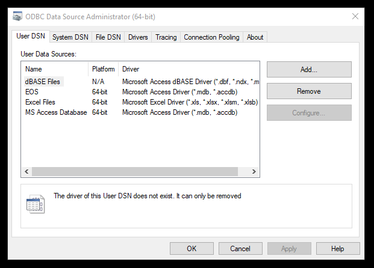
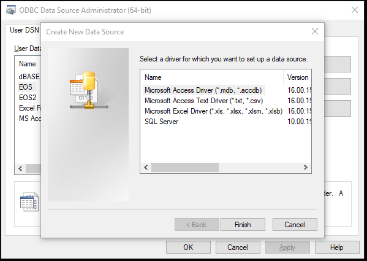
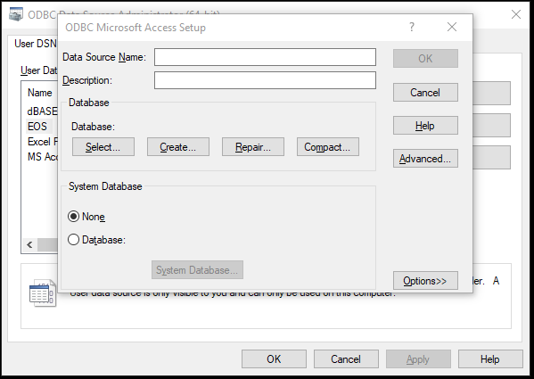
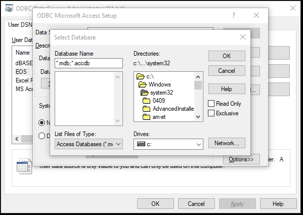
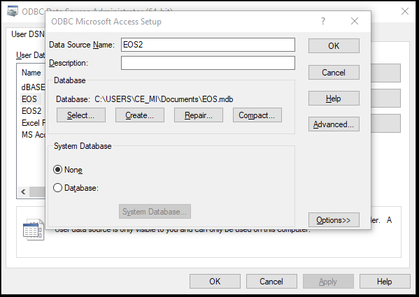

```{r setup, include=FALSE}
knitr::opts_chunk$set(echo = FALSE)
# library(ggplot2)
library(tidyverse)
```
```{r, xaringanExtra-clipboard, echo=FALSE}
### this is just the code that creates the "copy to clipboard" function in the code blocks
htmltools::tagList(
  xaringanExtra::use_clipboard(
    button_text = "<i class=\"fa fa-clone fa-2x\" style=\"color: #301e64\"></i>",
    success_text = "<i class=\"fa fa-check fa-2x\" style=\"color: #90BE6D\"></i>",
    error_text = "<i class=\"fa fa-times fa-2x\" style=\"color: #F94144\"></i>"
  ),
  rmarkdown::html_dependency_font_awesome()
)
```
```{r createGraphic, echo=FALSE, eval=FALSE}
# as_tibble(list(x = 1,
#                y = 1)) -> tibDat
# 
# ggplot(data = tibDat,
#        aes(x = x, y = y)) +
#   geom_text(label = "M$oft Access mdb",
#             size = 20,
#             colour = "red",
#             angle = 30) +
#   xlab("") +
#   ylab("") +
#   theme_bw() +
#   theme(panel.grid.major = element_blank(),
#         panel.grid.minor = element_blank(),
#         panel.border = element_blank(),
#         panel.background = element_blank(),
#         axis.line = element_blank(),
#         axis.text = element_blank(),
#         axis.ticks = element_blank()) 
```
**Hm, second time in a row. Warning: this is pretty geeky stuff but this time it's more general IT than statistical**

The situation is that I have received a large lump of fascinating routine service data in M$ Access mdb format and I want to yank it into R to use it.

This is a "Work in progress page" as I am not yet where I want to be for this. At the moment (**19.vi.22**) I am going to split the issues into three:

1. OS dependent issues about setting up what R needs to be done in the OS to allow it to find the data.
   + Windoze (10 and 11).
   + Linux (Unbuntu 22.04 LTS but probably fairly generic)
2. Issues when you get through those issues and have R accessing the data.

For all this I am using the RODBC package as I've used it for this sort of task in the past.  I think there is at least one alternative package and if someone thinks others are better, do [contact me] (https://www.coresystemtrust.org.uk/contact-form/).

The generic issue is whatever OS you use you need something outside R, in the OS, that creates a pipeline that can open the mdb file and offer the data there for use by R, strictly by the RODBC package.  As I understand this the pipeline can be called an "ODBC" driver/connection.  ODBC means Open DataBase Connectivity, see a typically good Wikipedia article at https://en.wikipedia.org/wiki/Open_Database_Connectivity to get some of the history.

The connections look like this.

```{r connection model}
library(DiagrammeR)
# png(filename = "/media/chris/Clevo_SSD2/Data/MyR/R/distill_blog/test2/pipeline.png", height = 800, width = 600, units = "px", bg = "white")
grViz("digraph flowchart {
      # node definitions with substituted label text
      node [fontname = Helvetica, shape = rectangle]   
      
      # I confess that I hate creating diagrams this way.  I can see that DiagrammeR and the tools 
      # it leans on are powerful but the syntax strikes me as archaic and doesn't lend itself to 
      # reproducability

      ## Level 0 (total who opened links)
      R [label = '@@1']
      # edge definitions with the node IDs
      R -> RODBC
      RODBC -> R
      RODBC [label = '@@2']
      RODBC -> Connector
      Connector -> RODBC
      Connector [label = '@@3']
      Connector -> mdbfile
      mdbfile -> Connector
      mdbfile [label = '@@4']
      }

      ### these are the names mapping to the @@@# above
      [1]: 'R'
      [2]: 'RODBC package'
      [3]: 'ODBC connector (OS specific)'
      [4]: 'Access mdb file'
      ")
      # dev.off()

```

The downward arrows pass commands and the upward arrows return information.  The commands include the crucial ones to open a connection and to close it but mainly will be requests for content from the data or comamands to change it.  I don't change the mdb data at all preferring to keep any data manipulation I need for execution in R when I have pulled the information in.  Information coming back back up that pipeline can be purely contextually informative, e.g. that the connection has been successfully opened/closed, or may include warnings or errors, but when everything is fine, is usually just data.  You can (I did) hit the challenge that some of the data may be scored in ways that are understood by Access and SQL but not liked by R.  I actually only hit that when I tried to pull tables (the name for rectangular lumps of data in databases) through to tibbles.  Tibbles don't like "binary" data which is a legitimate column content in Access.  That pulls through to R dataframes but `as_tibble()` spits at it saying it will only accept vector data.  So brace yourself if you like using tibbles as I do, to pull the data into dataframes and then work out what to do with that little challenge.

So what is "SQL"?  To a greater or lesser extent the command side of things may or may not be using SQL.  I'm not clear whether it is always formally true that it is or not but I think it's safe to behave as though it is.  SQL is Structured Query Language (https://en.wikipedia.org/wiki/SQL).  You can ignore this if working in Windoze but I think that you have to use a tiny bit of SQL if working in Linux to make sure the Linux database system you use as part of the connector there is set up to work for you.

# OS dependent issues

## Windoze

I hate to admit it but this is much easier in Windoze than I have found it so far in Ubuntu.  The connector is specific to the mdb file you want to access and is called a DSN (Data Source Name) and is pretty much that, actually it gives a name to the file and, vitally, it tells Windoze which particular ODBC driver Windoze will need to access the file and create the link between client program (which doesn't have to be R with RODBC but could be anything that understands Windoze DSNs).  There are various routes to create a DSN but this works for me.

### Windoze 10

Start menu >> Windoze >> Administrative tools >> ODBC Data Sources (64 bit) then that gets you something like this.  (If you have a 32 bit version of Windoze 10, you will need ODBC Data Sources (32 bit)) I think but presumably that's the only version it will be offering you.  (Scratch the interweb to see how to find out if your version of Windoze is 64 bit or 32 bit.)



The great thing is that you can ignore almost everything in that rather packed little bit of screen space!  The main thing is that listing in the middle. In that one there are four rows now and the one that starts "EOS" is the one I created for the M$ file I want to access which is called EOS.mdb (you can call the DSN anything you want).  If you have never created any you won't see that one but you should see the other lines.  To create a new DSN you hit the Add button and get to this.



Choose the Access driver (selected by default, as you see there, I think).  Then hit the "Finish" button (which is a very silly label as you're not done yet!)



Now you fill in the name you want for the DSN (you will need this to access the data from R), the optional description and then you hit the Select button to get here.



Navigate to the mdb file you want to access and select it and hit the "OK" button which gets you back to this.



You can see that the path to the mdb file is now in there. Now hit that "OK" button and you are done: you have created your DSN and will be able to access it using RODBC from within R.

### Windoze 11##

You find ODBC Data Sources (64 bit) from the search icon on the task bar, after that everthing is the same as for Windoze 10.

## Opening the mdb file from within R (windoze version)

This gets you the idea but I'm running out of time for this bit of "work in progress". so I will have to come back to it to explain it and go into some wrinkles there. They may be unnecessary for you.

```
library(RODBC) # has the vital functions to access the database
library(tidyverse) # optional but I like working in the tidyverse manner if I can
# rm(list = ls()) # you might want to do this if you aren't using a new session and are 100% certain you won't delete anything you'll miss


### this opens the mdb file pointed to in the DSN created in Windoze
connEOS <- odbcConnect("EOS")

allTables3 <- sqlTables(connEOS) # get a list of all the tables in the database
allTables3

### pull one table through
sqlFetch(connEOS, "vw_Prodotti") %>% 
  as_tibble()

### close the connection
odbcClose(connEOS)
```

## Linux

There are clearly many ways of doing this and I found much information on the interweb.  Some I could ignore as it was for commercial options and I wanted a fully open source way of doing things.  In the end I gave up after a few hours failing to get it to work but I will summarise what I did in the hope that someone will tell me how to get all the way there.  If I find a way that works for me I will document it fully here as I really think a clear summary is not out there.  In what folllows I am mostly following https://gist.github.com/amirkdv/9672857.  I think everything needs `libodbc1` but I think that's installed by default in Ubuntu.

```
chris@Clevo1:sudo apt-get install libodbc1
Reading package lists... Done
Building dependency tree... Done
Reading state information... Done
libodbc1 is already the newest version (2.3.9-5).
0 to upgrade, 0 to newly install, 0 to remove and 0 not to upgrade.
```

I think the first thing we need that isn't installed by default is the unixodbc package.

```
sudo apt-get instal unixodbc
```
should get it.

One thing that is useful is the [mdbtools package](https://github.com/mdbtools/mdbtools). You can (of course) install that with:

```
sudo apt-get install mdbtools
```

and it gives you the command `mdb-tables` which lists the tables in an mdb file:

```
### find the tables in your mdb file
chris@Clevo1:mdb-tables EOS.mdb 
dbo_Richieste dbo_TabAreaScala dbo_TabCollocazioneAmbientale dbo_TabInviante dbo_TabOperatori dbo_TabPrestazioni dbo_TabProdotti dbo_TabProfessioni dbo_TabQualifiche dbo_TabSettoriEconomici dbo_TabStatiCivili dbo_TabTipoDimissione dbo_TabTipoScala dbo_Valutazione dbo_ValutazioneRisposte dbo_vw_AnamnesiQuestionario vw_CartelleLista vw_ChiaviMultiple vw_Diagnosi vw_PazientiLista vw_Prestazioni vw_Prodotti vw_ProdottiPrestazioni vw_ScaleValutazione dbo_TabDistretto dbo_TabScolarita dbo_vw_AnamnesiRisposte

### find the number of rows in any particular table
chris@Clevo1:mdb-count EOS.mdb dbo_Richieste
49600

### export any table to CSV
chris@Clevo1:mdb-export EOS.mdb dbo_Richieste > dbo_Richieste.csv
```

That was reassuring not least in confirming that my Ubuntu 22.04 had no problem opening and reading the mdb file.  In principle I believe it should be possible to create a connector a bit like a DSN in Windoze using the odbc-mdbtools package so I install that in  command terminal:

```
sudo apt-get install odbc-mdbtools
```

In principle what you need now is to add two blocks, one to /etc/obcinst.ini which defines the driver:
```
[MDBTools]
Description = MDBTools Driver
Driver      = libmdbodbc.so.1
Setup       = libmdbodbc.so.1
FileUsage   = 1
UsageCount  = 1
```

and then one in /etc/odbc.ini which defines the source file (EOS.mdb):
```
[EOS]
Description=EOS database
Driver=MDBTools
Database=/media/chris/Clevo_SSD2/Data/CORE/translations/Italian/Modenaplus_CORE-OM/EOS.mdb
```

In principle that should work and the interactive sql command `isql` from the unixodbc package ought to open the file but for me it doesn't:

```
isql -v EOS
[IM002][unixODBC][Driver Manager]Data source name not found and no default driver specified
[ISQL]ERROR: Could not SQLConnect
```

The RDBOC route from R gives the same message.  I have tried copying those ini files to my home directory `~`, i.e. `/home/chris/` but that doesn't change anything. Permissions look fine to me:

```
chris@Clevo1:ls -lsart /etc/odbc*
4 -rw-r--r-- 1 root root 145 Jun 19 15:18 /etc/odbc.bak
4 -rw-r--r-- 1 root root 530 Jun 19 15:18 /etc/odbcinst.bak
4 -rw-r--r-- 1 root root 139 Jun 19 16:05 /etc/odbcinst.ini~
4 -rw-r--r-- 1 root root 132 Jun 19 16:05 /etc/odbc.ini~
4 -rw-r--r-- 1 root root 138 Jun 19 16:21 /etc/odbc.ini
4 -rw-r--r-- 1 root root 134 Jun 19 16:21 /etc/odbcinst.ini
chris@Clevo1:ls -lsart ~/odbc*
4 -rw-r--r-- 1 chris chris 139 Jun 19 16:11 /home/chris/odbcinst.ini~
4 -rw-r--r-- 1 chris chris 133 Jun 19 16:11 /home/chris/odbcinst.ini
4 -rw-r--r-- 1 chris chris 530 Jun 19 16:11 /home/chris/odbcinst.bak
4 -rw-r--r-- 1 chris chris 132 Jun 19 16:11 /home/chris/odbc.ini~
4 -rw-r--r-- 1 chris chris 326 Jun 19 16:11 /home/chris/odbc.ini
4 -rw-r--r-- 1 chris chris 145 Jun 19 16:11 /home/chris/odbc.bak
```

If anyone can put me straight about what I'm doing wrong, I'd really appreciate it, do [contact me] (https://www.coresystemtrust.org.uk/contact-form/).

## Opening the mdb file from within R (Linux version)

Same as in Windoze, see above.

# More on using the database in R

To come.

<center>Visit count</center>
<center>
<div id="sfccycqxxmehf797cbgun6wtkedbtkcsmp1"></div><script type="text/javascript" src="https://counter11.optistats.ovh/private/counter.js?c=cycqxxmehf797cbgun6wtkedbtkcsmp1&down=async" async></script><br><a href="https://www.freecounterstat.com">website hit counter</a><noscript><a href="https://www.freecounterstat.com" title="website hit counter"></a></noscript>
</div></center>

# Dates

* *1.x.24 Updates.*
* *19.vi.22 First created.*


## Last updated{.appendix}
```{r,echo=FALSE}
cat(paste(format(Sys.time(), "%d/%m/%Y"), "at", format(Sys.time(), "%H:%M")))
```