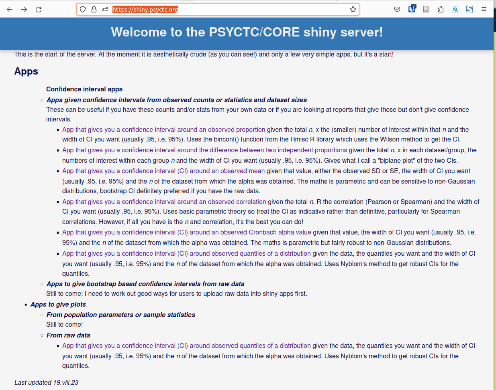

```{r setup, include=FALSE}
knitr::opts_chunk$set(echo = FALSE)
```
Here it is:



This is going to be one of the posts here that (I hope) will grow and become more useful as I get to know more.

## What is a shiny server?

Shiny is an R package.  I've written a bit about it in my [OMBook glossary](https://www.psyctc.org/psyctc/book/glossary/): https://www.psyctc.org/psyctc/glossary2/shiny-server-apps/ which has links to more formal sources from Posit, the company who maintain it.  

## Why am I creating a shiny server?

What I want is for the server to offer interactive online apps that allow end users to enter information, whether that's changing the parameters of a model, entering summary findings or entering raw data.  I am designing the apps to give results as one or more of: 

* numeric analyses, 
* graphics or 
* (not yet) text comments based on the analyses.

The hope is that this will be useful particularly to practitioners who don't have access to statisticians or researchers but I also hope some things may be helpful to researchers.

## What is needed to create a shiny server?

Well it's based on an R package so you need R and a computer on which to run it!  If you just want to play with it you can run it on any computer on which you can run R and have installed the shiny package.  When you run a shiny app (more on that below) it will create a local http server serving up the app you created as an html file.

However, what I wanted was something that anyone could use so I needed a machine visible on the internet that had R and the shiny package on it.  Of course I chose a machine running a Linux operating system to go with my open source loyalties and it was a no brainer to go to the internet service provider, [Mythic Beasts](https://www.mythic-beasts.com/) that I have used very happily for many internet things, now all my servers and Email.  So my shiny server is running on a Debian based virtual machine with, at this point (20.viii.23) 2 cores (/proc/cpuinfo tells me these are "Intel Xeon E312xx (Sandy Bridge)"), 4Gb of RAM and 1Gb of SSD drive.  Time will tell if this is enough machine for what usage emerges.

Mythic Beasts set up the server and installed the default R for Debian at the moment and installed the shiny package and did the arcane things to ensure that shiny.psyctc.org is visible from the internet over either ipv4 or ipv6 and they look after the hardware, the operating system and do daily backups.  

I had to upgrade R to the current version (4.3.1) and then of course update its default packages and install the huge number that my default R set up now seems to use.

### Backups and synching

As I say, Mythic Beasts look after a daily backup of the entire virtual machine so that could be restored with a maximum loss of information of 23.999 hours!  In that event what would  be out of date would be:

1. any recent Debian, R and R package updates but they could all be easily restored (I should probably write a short bash script to do that)

2. logs from that period (but I feel I can live without them, if I ever change my mind I could probably write a cron script that would store log increments off the server fairly frequently but I really think that's overkill)

3. anything I'd changed in terms of the apps.

That last would be a pain but that brings us to this next.

### Building apps locally and uploading to the server via github using git

This is a seriously geeky bit but makes things safer and easier for me.

The way I do things is that I do have shiny running on my local laptop and I do all my development work on the apps there in [Rstudio](https://posit.co/products/open-source/rstudio/) with the whole set of apps a "project" in Rstudio and git initiated for that project.  I won't go into git's subtleties (which have often caught me out over perhaps ten years using git and Rstudio projects).  It's an amazingly powerful change tracking system with no real competitor for my purposes (though you may want to use subversion).  I have also created a free account on github which is a wonderful resource providing paid and free online storage to a large extent based on git.  My account is https://github.com/cpsyctc and the shiny server repository there is https://github.com/cpsyctc/shiny-server.  

This allows me every time I make some changes to the apps or create a new one I "commit" them locally on my laptop which means that git stores the changes I've made since the last commit and a comment I make on them.  I can then "push" the commit to my github repository (with two simple bits of authentication) and I can then "pull" those from github to the shiny server.  So I would always have the latest changes stored on my laptop and on github if the server dies (yes I'm paranoid).  There are some subtleties about making sure the server is authorised to pull the latest changes from github and I will in time set up a cron job on the shiny server that will check at intervals to see if there are new changes and pull them if there are (as I do for my [Rblog](https://www.psyctc.org/Rblog/) distill server on a different Mythic Beasts server!)

## But how do you make apps?

This is where it gets a bit tough in my opinion (not that that lot wasn't geeky).  Shiny apps have a very fixed structure with only two main ways in which to structure them one of which splits the code into two files, the other which keeps everything in one file.  I'm using that approach at the moment.  

This way all my apps sit in a subdirectory of the shiny project: apps and each is has a subdirectory of its own with the name of the app.  So my CImean app has its subdirectory CImean.  One thing I don't much like is that for the app to work, all the code always goes into a file in that directory named app.R.  That can make it easy to forget which file you're in so I put the directory/app name at the top of all my app.R files as a comment.  Perhaps there's a way for Rstudio to show not just source file names but their directory, but if so, I haven't found it.

Those are the easy bits though, the crunch is that to create a "reactive" program, i.e. one that reacts to the inputs given to it, is a very different challenge from the normal "start from the top and work through" sequence of a non-interactive R or Rmd source file. (Yes, yes, I know that the sequence in those has some diversions if you're declaring functions but the principle is sound.)

This means that I'm really struggling to adapt to this new way of doing things and find that most of my expectations from R and Rmd (R markdown) have to be dropped.  The main thing that throws me is this issue about the sequence of execution and hence of where to find what's doing what in the source.  Then the next challenge is debugging and how to work out what's wrong when, as is my norm, my first draft doesn't do what I want or doesn't work at all.

I will come back to some of my emerging strategies over the next week as, I hope, they improve!

## Dates

* Skeleton only started 19.viii.23
* First lumps of text 20.viii.23


