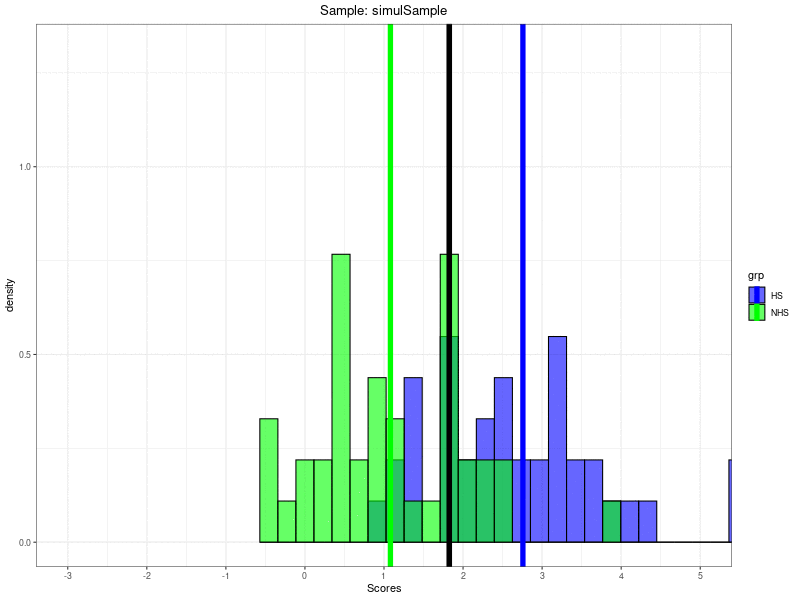

```{r setup, include=FALSE}
knitr::opts_chunk$set(echo = FALSE, message = FALSE, warning = FALSE, fig.width = 16, fig.height = 12, cache = FALSE)
library(tidyverse)
library(boot)
library(flextable)
library(CECPfuns)
library(gganimate)

### set ggplot defaults
theme_set(theme_bw())
theme_update(plot.title = element_text(hjust = .5),
             plot.subtitle = element_text(hjust = .5),
             text = element_text(size = 24))
```

# Getting some data

The exploration and testing of the bootstrap methods of getting a confidence interval (CI) around the method c, CSC (Clinically Significant Change) criterion starts with two sets of data: one from a non-help-seeking (NHS, "non-clinical") and one from a help-seeking (HS, "clinical") population.  In real life these are rarely true random samples from defined populations not least because people don't walk around with badges on them saying "NHS" and "HS" so the issues about generalising from real life NHS and HS datasets to get a general CSC are complex but we can dodge that because those issues don't affect whether the bootstrap methods of getting a CI around an observed CSC are good methods as we're starting with a model, a simulation, of a true sampling process.  

The CSC method c (and the frankly pretty absurd methods a and b) all start with the idea that the scores have Gaussian ("Normal") distributions where the population means, and perhaps the standard deviations (SDs) are different for the NHS and HS populations.  With that Gaussian model those four population parameters: two means and two SDs, completely define the two population distributions of scores.

```{r showModel}
nNHS <- 40
nHS <- 40
meanNHS <- 1
meanHS <- 2.6
sdNHS <- 1
sdHS <- 1
valTrueCSC <- 1.8

tibble(x = seq(-3, 5.5, .001)) %>%
       mutate(yNHS = dnorm(x, mean = meanNHS, sd = sdNHS),
              yHS = dnorm(x, mean = meanHS, sd = sdHS)) -> tibPopuln

ggplot(data = tibPopuln,
       aes(x = x)) +
  geom_point(aes(y = yNHS),
             colour = "green") +
  geom_point(aes(y = yHS),
             colour = "blue") +
  geom_vline(xintercept = valTrueCSC,
             linewidth = 2) +
  geom_vline(xintercept = meanNHS,
             colour = "green",
             linetype = 2,
             linewidth = 1.5) +
  geom_vline(xintercept = meanHS,
             colour = "blue",
             linetype = 2,
             linewidth = 1.5) +
  xlab("Score") +
  scale_x_continuous("Scores",
                     seq(-3, 5),
                     limits = c(-3, 5.5)) +
  scale_y_continuous("Density",
                     breaks = seq(0, .5, 1),
                     limits = c(0, .5),
                     expand = c(0, 0)) +
  ggtitle(paste0("Population misclassification using the correct population CSC of ",
                 valTrueCSC),
          subtitle = "Black reference line marks CSC, dashed vertical lines are population means")
```

The equation that gives the CSC value is

$$ \frac{\left( mean_{NHS} * sd_{HS} \right) + \left( mean_{HS} * sd_{NHS} \right) }{sd_{NHS} + sd_{HS}} $$

The crucial quality of that CSC is that, for Gaussian distributions, it will always give the same misclassification rate for the NHS population as for the HS population.  That's shown in this plot.

```{r showModelMisclassification}
ggplot(data = tibPopuln,
       aes(x = x)) +
  geom_point(aes(y = yNHS),
             colour = "green") +
  geom_point(aes(y = yHS),
             colour = "blue") +
  geom_vline(xintercept = valTrueCSC,
             linewidth = 2) +
  geom_vline(xintercept = meanNHS,
             colour = "green",
             linetype = 2,
             linewidth = 1.5) +
  geom_vline(xintercept = meanHS,
             colour = "blue",
             linetype = 2,
             linewidth = 1.5) +
  geom_ribbon(data=subset(tibPopuln,
                          x > valTrueCSC & x < Inf),
              aes(ymax = yNHS),
              ymin = 0,
              fill = "green",
              colour=NA,
              alpha=0.5) +
  geom_ribbon(data=subset(tibPopuln,
                          x > -Inf & x < valTrueCSC),
              aes(ymax = yHS),
              ymin = 0,
              fill = "blue",
              colour=NA,
              alpha=0.5) +
  scale_x_continuous("Scores",
                     breaks = seq(-2,5),
                     limits = c(-3, 5.5)) +
  scale_y_continuous("Density",
                     breaks = seq(0, .5, 1),
                     limits = c(0, .5),
                     expand = c(0, 0)) +
  ggtitle(paste0("Population misclassification using the correct population CSC of ",
                 valTrueCSC),
          subtitle = paste("Shaded blue area is help-seeking people scoring below the CSC",
                           "\nand shaded green area is that of  the non-help-seeking people scoring above the CSC"))
```

A simulation starts with generating the two samples we need using that Gaussian model.  Here's a first simulation run creating an NHS and HS sample each of size
`r nNHS` and both with from populations with SD 
`r sdNHS`.  The NHS population mean is 
`r meanNHS` with the HS population mean 
`r meanHS`.

For what it's worth, the R function to get a sample from a Gaussian population is:
```
rnorm(n, mean = 1, sd = 1)
```
where n is the sample size you want, mean the mean and sd the SD.  As that code says, the mean and SD default to 1.0, i.e. to the parameters of the standard Gaussian distribution if they are omitted.  Here is the first simulation.

```{r genData, eval=TRUE}
genData <- function(nNHS, nHS, meanNHS, meanHS, sdNHS, sdHS, nSims){
  tibble(simN = list(1:nSims)) %>%
    unnest_longer(simN) %>%
    rowwise() %>%
    mutate(trueCSC = (sdHS*meanNHS + sdNHS*meanHS) / (sdHS + sdNHS),
           scoresNHS = list(rnorm(nNHS, mean = meanNHS, sd = sdNHS)),
           scoresHS = list(rnorm(nHS, mean = meanHS, sd = sdHS)),
           meanNHS = mean(scoresNHS),
           sdNHS = sd(scoresNHS),
           meanHS = mean(scoresHS),
           sdHS = sd(scoresHS),
           obsCSC = ((meanNHS * sdHS) + (meanHS * sdNHS)) / (sdNHS + sdHS)) %>%
    ungroup()
}
genData(nNHS = nNHS, nHS = nHS, meanNHS = meanNHS, meanHS = meanHS, sdNHS = sdNHS, sdHS = sdHS, 1) -> tibDat

### messy as data were not ideally shaped
# tibDat %>%
#   select(scoresNHS) %>%
#   unnest_longer(scoresNHS) %>%
#   pull() -> vecScoresNHS
tibDat %>%
  select(scoresNHS) %>%
  unnest_longer(scoresNHS) %>%
  rename(scores = scoresNHS) %>%
  mutate(grp = "NHS") -> tibScoresNHS

# tibDat %>%
#   select(scoresHS) %>%
#   unnest_longer(scoresHS) %>%
#   pull() -> vecScoresHS
tibDat %>%
  select(scoresHS) %>%
  unnest_longer(scoresHS) %>%
  rename(scores = scoresHS) %>%
  mutate(grp = "HS") -> tibScoresHS

bind_rows(tibScoresNHS,
          tibScoresHS) -> tibScores

vecColoursGrps <- c("NHS" = "green", "HS" = "blue")

ggplot(data = tibScores,
       aes(x = scores, fill = grp, group = grp)) +
  geom_histogram(aes(y = after_stat(density)),
                 position = "identity",
                 colour = "black",
                 alpha = .8, 
                 bins = 30) +
  scale_x_continuous("Scores",
                     breaks = -3:5) +
  coord_cartesian(xlim = c(-3, 5)) +
  scale_fill_manual(values = vecColoursGrps) +
  ggtitle("Histogram of first simulation samples, samples overlaid",
          subtitle = paste0("Both samples n = ",
                            nNHS,
                            " HS sample blue, NHS green, overload points dirty green!"))
```

Of course the sample statistics are not the same as the population parameters.

```{r sampleStats}
tibScores %>%
  group_by(grp) %>%
  summarise(n = n(),
            mean = mean(scores),
            sd = sd(scores)) -> tmpTib

((meanNHS * sdHS) + (meanHS * sdNHS)) / (sdNHS + sdHS) -> populnCSC

getCSC(scores ~ grp, data = tibScores) -> sampCSC

ggplot(data = tibScores,
       aes(x = scores, fill = grp, group = grp)) +
  geom_histogram(aes(y = after_stat(density)),
                 position = "identity",
                 colour = "black",
                 alpha = .6, 
                 bins = 30) +
  geom_vline(xintercept = sampCSC,
             linewidth = 2.5) +
  geom_vline(data = tmpTib,
             aes(xintercept = mean,
                 colour = grp),
             linewidth = 2.5) +
  scale_x_continuous("Scores",
                     breaks = -3:5) +
  coord_cartesian(xlim = c(-3, 5)) +
  scale_fill_manual(values = vecColoursGrps) +
  scale_colour_manual(values = vecColoursGrps) +
  ggtitle("Histogram of first simulation samples, samples overlaid",
          subtitle = "Vertical lines mark sample means with sample CSC in black")
```

Here are the actual sample statistics.

```{r}
tmpTib %>%
  flextable() %>%
  colformat_double(digits = 3)
```

That illustrates just how far from the population means and SDs the sample statistics can be even with sample sizes of 
`r nNHS`.

The sample CSC is:

```{r getCSC, echo=TRUE}
### uses the getCSC function from the CECPfuns package
getCSC(scores ~ grp, data = tibScores)
```

That too is a long way from the population CSC which we know is:

```{r}
((meanNHS * sdHS) + (meanHS * sdNHS)) / (sdNHS + sdHS)
```

So it would be helpful to have a confidence interval around an observed sample CSC to give us an idea of the likely imprecision of the sample CSC as a substitute for the population CSC.

# Bootstrapping

Bootstrapping (from pulling yourself up by your bootstraps) works by "resampling": creating new samples of the same size as the originals by sampling randomly from those samples *with replacement* so any of the observations in the original sample can appear in the resample zero, once or more often. The appropriate boostrap resampling for a two group/sample issue like the CSC is the *stratified* bootstrap where resampling happens within the groups.

This shows the first 10 values (in ascending order of scores) from each group and the resampled values `bootSampScore1`.

```{r bootstrap1}
set.seed(12345)
tibScores %>%
  arrange(desc(grp), scores) %>%
  group_by(grp) %>%
  mutate(indN = row_number(),
         bootSampScore1 = sample(scores, nNHS, replace = TRUE)) %>%
  ungroup() -> tibBoot1
         
tibBoot1 %>%
  select(grp, indN, scores, bootSampScore1) -> tmpTib

tmpTib %>%
  filter(indN < 11) %>%
  as_grouped_data(groups = "grp") %>%
  flextable()
```

As the resampling was at random any correlation between the original scores and the resampling created scores will be random.

```{r}
tibBoot1 %>%
  group_by(grp) %>%
  summarise(corr = list(getBootCICorr(scores ~ bootSampScore1, data = pick(everything())))) %>%
  unnest_wider(corr) %>%
  flextable() %>%
  colformat_double(digits = 3)
```

Yes.  Observed correlations (within groups) safely inside 95% CIs for a population zero correlation.

This shows for the first ten scores in the original NHS sample how many times each value appears in the fully resampled NHS sample.

```{r}
tibBoot1 %>%
  filter(grp == "NHS") %>%
  select(bootSampScore1) %>%
  pull() -> tmpVecNHSbootScores

tibBoot1 %>%
  filter(grp == "HS") %>%
  select(bootSampScore1) %>%
  pull() -> tmpVecHSbootScores

tibBoot1 %>%
  filter(grp == "NHS") %>%
  rowwise() %>%
  mutate(nCopies = sum(scores == tmpVecNHSbootScores)) %>%
  ungroup() %>%
  select(grp, indN, nCopies) %>%
  filter(indN < 11) %>%
  flextable()
```

So the first two values don't appear in the bootstrap sample NHS scores at all but then the third value appears 3 times, the fourth doesn't appear and the fifth appears twice, and so on.  Here is the breakdown of number of copies across all
`n nNHS` sample values.

```{r}
tibBoot1 %>%
  filter(grp == "NHS") %>%
  rowwise() %>%
  mutate(nCopies = sum(scores == tmpVecNHSbootScores)) %>%
  ungroup() %>%
  count(nCopies) %>%
  flextable()
```

Here's the same breakdown for the HS bootstrap resampled data.

```{r}
tibBoot1 %>%
  filter(grp == "HS") %>%
  rowwise() %>%
  mutate(nCopies = sum(scores == tmpVecHSbootScores)) %>%
  ungroup() %>%
  count(nCopies) %>%
  flextable()
```

This facetted histogram juxtaposes the histogram of the simulated data ("simulation1") with the first stratified bootstrap replication from those first simulated samples.

```{r}
tibBoot1 %>%
  select(-indN) %>%
  pivot_longer(cols = c(scores, bootSampScore1), names_to = "sample", values_to = "scores") %>%
  mutate(sample = if_else(sample == "scores", "simulation1", "bootstrap1"),
         sample = ordered(sample,
                          levels = c("simulation1", "bootstrap1"))) -> tibBoot1long

tibBoot1long %>%
  group_by(sample) %>%
  mutate(csc = getCSC(scores ~ grp, data = pick(everything()))) %>%
  group_by(grp, sample) %>%
  mutate(csc = first(csc),
         mean = mean(scores),
         sd = sd(scores)) -> tmpTib

ggplot(data = tibBoot1long,
       aes(x = scores, colour = grp)) +
  facet_grid(rows = vars(sample)) +
  geom_histogram(aes(y = after_stat(density),
                     fill = grp),
                 position = "identity",
                 colour = "black",
                 alpha = .6, 
                 bins = 30) +
  geom_vline(data = tmpTib, 
             aes(xintercept = csc),
             linewidth = 2.5) +
  geom_vline(data = tmpTib,
             aes(xintercept = mean,
                 colour = grp),
             linewidth = 2.5) +
  scale_x_continuous("Scores",
                     breaks = -3:5) +
  coord_cartesian(xlim = c(-3, 5)) +
  scale_fill_manual(values = vecColoursGrps) +
  scale_colour_manual(values = vecColoursGrps) +
  ggtitle("Histogram of scores by NHS versus HS group",
          subtitle = "Facetted by sample: first simulationi or first bootstrap resample of that")
```

It can be seen that as the resampling creates a new dataset so the means and SDs change and so too does the observed CSC from the data.

This animated histogram cycles through the first simulation data and then five bootstrap resampling datasets.

```{r animate, eval=TRUE}
set.seed(12345)
tibScores %>%
  group_by(grp) %>%
  mutate(indN = row_number()) %>%
  ungroup() %>%
  pivot_wider(names_from = grp, values_from = scores) -> tibScoresWide

resample <- function(tibScoresWide, nReps) {
  n <- nrow(tibScoresWide)
  
  vecReps <- paste0("bootRep", sprintf("%03.0f", 1:nReps))
  
  tibble(repN = list(1:nReps),
         indN = list(1:n)) %>%
    unnest_longer(repN) %>%
    mutate(repN = paste0("bootRep", sprintf("%03.0f", repN))) %>%
    unnest_longer(indN) %>%
    group_by(repN) %>%
    mutate(NHS = sample(unlist(tibScoresWide$NHS), n, replace = TRUE),
           HS = sample(unlist(tibScoresWide$HS), n, replace = TRUE)) -> tmpTib
  
  tibScoresWide %>%
    mutate(repN = "simulSample") %>%
    select(repN, everything()) -> tmpTib2
  
  bind_rows(tmpTib2,
            tmpTib) %>% 
    mutate(repN = ordered(repN,
                          levels = c("simulSample",
                                     vecReps)))
}
resample(tibScoresWide, 5) -> tibLong

tibLong %>%
  pivot_longer(cols = NHS:HS, names_to = "grp", values_to = "scores") -> tibLong2

tibLong2 %>%
  group_by(repN) %>%
  mutate(csc = getCSC(scores ~ grp, data = pick(everything()))) %>%
  ungroup() %>%
  group_by(grp, repN) %>%
  summarise(csc = first(csc),
         mean = mean(scores),
         sd = sd(scores)) %>%
  ungroup() -> tmpTib

ggplot(data = tibLong2,
       aes(x = scores, colour = grp)) +
  geom_histogram(aes(y = after_stat(density),
                     fill = grp),
                 position = "identity",
                 colour = "black",
                 alpha = .6, 
                 bins = 30) +
  geom_vline(data = tmpTib, 
             aes(xintercept = csc),
             linewidth = 2.5) +
  geom_vline(data = tmpTib,
             aes(xintercept = mean,
                 colour = grp),
             linewidth = 2.5) +
  scale_x_continuous("Scores",
                     breaks = -3:5) +
  coord_cartesian(xlim = c(-3, 5)) +
  scale_fill_manual(values = vecColoursGrps) +
  scale_colour_manual(values = vecColoursGrps) +
  ggtitle("Histogram of scores, means and CSCs by sample/resample") -> tmpPlot


# tmpPlot +
#   gganimate::transition_states(repN) +
#   labs(title = "Sample: {closest_state}",
#        transition_length = 0,
#        wrap = TRUE) +
#   enter_appear() +
#   exit_disappear() -> tmpAnimate
# 
# anim_save("animate1.gif", tmpAnimate, width = 800, height = 600)
```



I'm not sure if animating, with its insistence on cross-fading, conveys the extent to which the bootstrap resamples vary and are different from the sample from which they are created.  I'm not sure this facetted plot, with the simulated sample top left then the save five resamples as in the animation is any better.

```{r facets}
ggplot(data = tibLong2,
       aes(x = scores, colour = grp)) +
  geom_histogram(aes(y = after_stat(density),
                     fill = grp),
                 position = "identity",
                 colour = "black",
                 alpha = .6, 
                 bins = 30) +
  facet_wrap(facets = vars(repN),
             ncol = 2) +
  geom_vline(data = tmpTib, 
             aes(xintercept = csc),
             linewidth = 2.5) +
  geom_vline(data = tmpTib,
             aes(xintercept = mean,
                 colour = grp),
             linewidth = 2.5) +
  scale_x_continuous("Scores",
                     breaks = -3:5) +
  coord_cartesian(xlim = c(-3, 5)) +
  scale_fill_manual(values = vecColoursGrps) +
  scale_colour_manual(values = vecColoursGrps) +
  ggtitle("Histogram of scores, means and CSCs by sample/resample") 
```

However, I hope that the above has explained the creation of bootstrap resampling datasets.

## So we get resampled datasets: how does that help?

Primarily because it enables us to construct CIs around an observed statistic and CIs constructed by bootstrapping have some huge positives:

1. They don't need any algebraic, mathematical or parametric model: they just need data to resample.  

2. If the distributions of the observations are independent (hence the simple bootstrap won't work for time series data without a lot of other tricks), if the distributions of the variables don't have huge discontinuitie nor very limited variances and if the *n* aren't tiny then the CIs can be very well behaved. 

What does "well behaved mean" for CIs?

   * They should include the true population parameter somewhere near 95% of the time (assuming that you asked for the 95% CI). That is to say they tend to have fairly accurate "coverage".
   
   * Similarly, the of generally fairly unbiased: the CIs falling entirely below the population parameter about as often as entirely above it.
   
When I first met bootstrapping that struck me as a bit too good to be true and that wasn't just my natural scepticism: there is no guarantee that for any particular population parameter you want to estimate from the data you have that the bootstrap method will work well and it doesn't escape the issues, equally important when generalising in any way from a given dataset to a population or even to general implications.  If the data you have are tiny the bootstrap can't escape how that limits generalisation (and I have a suspicion that with very small datasets it may give wild CIs that, if at the one end of wild may look overly reassuring though with tiny *n* bootstrapping may simply be wild and might give very wide CIs, I try not to use bootstrapping now with minimum *n* < 40 though that's a rule I pretty much plucked out of my imagination, much would depend on the parameter of interest and its distribution).  Perhaps more importantly, if your dataset was created (sampled) in a way that makes it unrepresentative of the population to which you want to generalise or for which you want to create implications then bootstrap analyses will be as misleading as any other analyses.  (And just pleading a few other issues in "limitations" should never be allowed to hide this.)

What is the logic to this?  Well, there is some sophisticated maths for it for many parameters and distributions but as I see it the logic is that the data we have is the [best|latest|only] data we have on which to speculate.  So to build up from it (bootstraps? shoelaces?) by looking at how the statistic you are extracting from your dataset changes as you randomly change the data you have, but always sticking within your data, should give you a sensible guide to how precisely you might be estimating a population parameter.

## So how do you construct a bootstrap CI?

There are a number of ways of doing it but for a lot of statistics/parameters only four are likely to be appropriate. Unsurpisingly, these are four that the R package boot will offer for most analyses. They are:

* percentile

* basic

* normal

* bca (bias controlled and accelerated)

I may come back to the others in other posts but the easiest to explain is the percentile so I'm going to stick with that here

### Constructing a percentile bootstrap CI

```{r tweakgetBootCICSC, eval=TRUE}
tibScores %>%
  mutate(grp = ordered(grp,
                       levels = c("NHS", "HS")),
         grp = as.numeric(grp)) %>%
  as.data.frame() -> tmpDat
  
getCSClocal <- function(tmpDat) {
  tmpDat %>% 
    dplyr::group_by(grp) %>% 
    dplyr::summarise(n = n(), 
                     mean = mean(scores), 
                     sd = sd(scores)) -> tibStats 
  tibStats %>% 
    dplyr::summarise(denominator = sum(sd)) %>% 
    dplyr::pull() -> denominator
  
  tibStats$mean[2] * tibStats$sd[1] + tibStats$mean[1] * tibStats$sd[2] -> numerator
  
  numerator/denominator
}

getCSCforBoot <- function(tmpDat, i) {
  getCSClocal(tmpDat[i, ])
}

set.seed(12345)
tmpBootRes <- boot::boot(tmpDat, 
                         statistic = getCSCforBoot, 
                         stype = "i", 
                         strata = tmpDat[, 2], 
                         R = 1000,
                         parallel = "multicore", 
                         ncpus = 8)

vecCSCs <- tmpBootRes$t
```
```{r percentileCI1}
as_tibble(vecCSCs) %>%
  rename(bootCSCs = 1) -> tibBootCSCs

tibBootCSCs %>%
  summarise(n = n(),
            mean = mean(bootCSCs),
            SD = sd(bootCSCs)) -> tibBootCSCstats

ggplot(data = tibBootCSCs,
       aes(x = bootCSCs)) +
  geom_histogram(alpha = .5) +
  geom_vline(xintercept = tibBootCSCstats$mean) +
  xlab("CSC values from each bootstrap resample") +
  ggtitle(paste0("Histogram of CSCs from ",
                 nrow(tibBootCSCs),
                 " bootstrap resamples of data above"),
          subtitle = "Vertical reference line is mean of the CSCs")
```

The mean of those bootstrap CSCs is 
`r round(tibBootCSCstats$mean, 3)` which is reassuringly close to the raw data CSC
`r round(sampCSC, 3)` and neither are far from the known population CSC (which we know because this is simulated data)
`r round(populnCSC, 3)`.  The distribution looks not way off from Gaussian (that's more important for some of the bootstrap CI methods than for the percentile method), more importantly for all bootstrap methods it looks fairly symmetrical and though there is one outlying (low) CSC, generally the spread doesn't look wild (taking us back to the issue of near Gaussian distribution really: it's not "heavy tailed" or "kurtotic").

```{r percentileCI2}
quantile(vecCSCs, c(.025, .975), type = 6) -> type6percentileCI
boot.ci(tmpBootRes,type = "perc")$percent[1, 4:5] -> tmpBootCIPercentile
```

The 95% bootstrap CI for the CSC here, by the percentile method, is the range between the 2.5% and 97.5% percentiles of those CSCs which turns out to be from 
`r round(tmpBootCIPercentile[1], 2)` to
`r round(tmpBootCIPercentile[2], 2)`.  In this next plot I've shown this on another histogram of the same 
`r nrow(tibBootCSCs)` bootstrap resampling CSC values.  (In this histogram I've used a much narrower "bin width" so the general shape is less clear but I can make the shading fit the percentiles!)  The central 95% of the resamples are coloured green and the lowest 2.5% are showin purple and highest 2.5% in red.

```{r percentileCI3}
# quantile(vecCSCs, c(.025, .975))
ggplot(data = tibBootCSCs,
       aes(x = bootCSCs)) +
  geom_histogram(alpha = .5,
                 binwidth = .005,
                 fill = "green") +
  geom_vline(xintercept = tibBootCSCstats$mean) +
  geom_vline(xintercept = type6percentileCI[1],
             colour = "purple",
             linewidth = 1,
             linetype = 2) +
  geom_vline(xintercept = type6percentileCI[2],
             colour = "red",
             linetype = 2,
             linewidth = 1) +
  geom_histogram(data = filter(tibBootCSCs,
                             bootCSCs < type6percentileCI[1]),
                 aes(x = bootCSCs),
                 binwidth = .005,
                 fill = "purple") +
  geom_histogram(data = filter(tibBootCSCs,
                             bootCSCs > type6percentileCI[2]),
                 aes(x = bootCSCs),
                 binwidth = .005,
                 fill = "red") +
  xlab("CSC values from each bootstrap resample") +
  ggtitle("Histogram of CSCs from 1,000 bootstrap resamples of data above",
          subtitle = "Black vertical reference line is mean of the CSCs, green give 95% percentile CLs")
```

For completeness here are all four CIs the four bootstrap CI methods gave for that particular simulated sample.

```{r fourMethods}
boot.ci(tmpBootRes,type = "norm")$norm[1, 2:3] -> tmpBootCInorm
boot.ci(tmpBootRes,type = "basic")$basic[1, 4:5] -> tmpBootCIbasic
boot.ci(tmpBootRes,type = "bca")$bca[1, 4:5] -> tmpBootCIbca
rbind(tmpBootCIPercentile,
      tmpBootCIbasic,
      tmpBootCInorm,
      tmpBootCIbca) -> tmp

colnames(tmp) <- c("LCL", "UCL")
as_tibble(tmp) %>%
  mutate(method = rownames(tmp),
         method = str_remove(method, fixed("tmpBootCI")),
         method = str_to_sentence(method),
         method = if_else(method == "Bca", "bca", method)) %>%
  select(method, LCL, UCL) %>%
  flextable() %>%
  colformat_double(digits = 3)
```

It can be seen that the methods do give different confidence limits but that the confidence intervals are very similar.  That brings us to one aspect of the next part of this document: using simulation to test the bootstrap CIs.

# Back to the simulation: testing the bootstrap CIs

As noted above the features of a well behaved CI are proper coverage, i.e. the CI should include the population CSC 95% of the time (or whatever width was set for the CI) and it should also show no or minimal bias: where it doesn't include the population CSC it should be too high about as often as it is too low.  

## Coverage 

```{r getData}
# load("tibBalancedN40to100")
# load("tibBalancedN120to200")
# load("tibBalancedN250to500")
# bind_rows(tibBalancedN40to100,
#           tibBalancedN120to200,
#           tibBalancedN250to500) -> tibBalancedAll
# tibBalanced <- tibBalancedN40to100
# rm(tibBalancedN40to100)
# # rm(tibBalancedN120to200)
# # rm(tibBalancedN250to500)
load("tibBalancedN40to200")

# getBootCICSC2 <- function (nNHS, nHS, meanNHS, meanHS, sdNHS, sdHS,
#                            bootReps = 1000, conf = 0.95,
#                            useParallel = "multicore", nCPUs = 12) {
#   RNG <- RNGkind()
#   seed <- .Random.seed
#   trueCSC <- (sdHS*meanNHS + sdNHS*meanHS) / (sdHS + sdNHS)
#   scoresNHS <- rnorm(nNHS, mean = meanNHS, sd = sdNHS)
#   scoresHS <- rnorm(nHS, mean = meanHS, sd = sdHS)
#   scores <- c(scoresNHS, scoresHS)
#   groups <- c(rep("NHS", nNHS), rep("HS", nHS))
#   tibble(scores = scores,
#          grp = groups) %>%
#     mutate(grp = ordered(grp,
#                          levels = c("NHS", "HS"),
#                          labels = c("NHS", "HS")),
#            grpN = as.numeric(grp)) -> tmpDat
# 
#   getCSClocal <- function(tmpDat) {
#     tmpDat %>%
#       dplyr::group_by(grp) %>%
#       dplyr::summarise(n = n(),
#                        mean = mean(scores),
#                        sd = sd(scores)) -> tibStats
#     tibStats %>%
#       dplyr::summarise(denominator = sum(sd)) %>%
#       dplyr::pull() -> denominator
# 
#     tibStats$mean[2] * tibStats$sd[1] + tibStats$mean[1] * tibStats$sd[2] -> numerator
# 
#     numerator/denominator
#   }
# 
#   getCSCforBoot <- function(tmpDat, i) {
#     getCSClocal(tmpDat[i, ])
#   }
# 
#   tmpDat <- as.data.frame(tmpDat)
# 
#   tmpBootRes <- boot::boot(tmpDat,
#                            statistic = getCSCforBoot,
#                            stype = "i",
#                            strata = tmpDat[, 2],
#                            R = bootReps,
#                            parallel = useParallel,
#                            ncpus = nCPUs)
#   ### OK, now you've got the bootstrap replications
#   ### now extract CI by each bootstrap method inside tryCatch()
# 
#   ### first the percentile method
#   getPercCI <- function(tmpBootRes, conf = conf){
#     tryCatch({
#         tmpCI <- boot::boot.ci(tmpBootRes, type = 'perc', conf = conf)
#         return(list(percLCLCSC = tmpCI$percent[4],
#                     percUCLCSC = tmpCI$percent[5]))
#       },
#       error = function(tmp) {
#         tmp <- NA
#         return(list(percLCLCSC = NA,
#                     percUCLCSC = NA))
#       }
#     )
#   }
#   percCI <- unlist(getPercCI(tmpBootRes, conf = conf))
#   percLCLCSC <- percCI[1]
#   percUCLCSC <- percCI[2]
# 
#   ### now the basic method
#   getBasicCI <- function(tmpBootRes, conf = conf){
#     tryCatch(
#       {tmpCI <- boot::boot.ci(tmpBootRes, type = 'basic', conf = conf)
#       return(list(basicLCLCSC = tmpCI$basic[4],
#                   basicUCLCSC = tmpCI$basic[5]))},
#       error = function(tmp) {
#         tmp <- NA
#         return(list(basicLCLCSC = NA,
#                     basicUCLCSC = NA))
#       }
#     )
#   }
#   basicCI <- unlist(getBasicCI(tmpBootRes, conf = conf))
#   basicLCLCSC <- basicCI[1]
#   basicUCLCSC <- basicCI[2]
# 
#   ### now the bca method
#   getBcaCI <- function(tmpBootRes, conf = conf){
#     tryCatch(
#       {tmpCI <- boot::boot.ci(tmpBootRes, type = 'bca', conf = conf)
#       return(list(bcaLCLCSC = tmpCI$bca[4],
#                   bcaUCLCSC = tmpCI$bca[5]))},
#       error = function(tmp) {
#         tmp <- NA
#         return(list(bcaLCLCSC = NA,
#                     bcaUCLCSC = NA))
#       }
#     )
#   }
#   bcaCI <- unlist(getBcaCI(tmpBootRes, conf = conf))
#   bcaLCLCSC <- bcaCI[1]
#   bcaUCLCSC <- bcaCI[2]
# 
#   ### now the normal method
#   getNormCI <- function(tmpBootRes, conf = conf){
#     tryCatch(
#       {tmpCI <- boot::boot.ci(tmpBootRes, type = 'norm', conf = conf)
#         return(list(normLCLCSC = tmpCI$normal[2],
#                     normUCLCSC = tmpCI$normal[3]))},
#       error = function(tmp) {
#         tmp <- NA
#         return(list(normLCLCSC = NA,
#                     normUCLCSC = NA))
#       }
#     )
#   }
#   normCI <- unlist(getNormCI(tmpBootRes, conf = conf))
#   normLCLCSC <- normCI[1]
#   normUCLCSC <- normCI[2]
# 
#   t <- tmpBootRes$t[, 1]
#   t <- as.vector(t)
#   ### name it to make unnesting it later not scream out for names_sep!!!
#   names(t) <- paste0("t", 1:length(t))
# 
#   retVal <- list(
#     ### RNG parameters
#     RNG = RNG,
#     seed = seed,
#     ### simulation parameters (population values)
#     trueCSC = trueCSC,
#     ### setup
#     parallel = useParallel,
#     nCPUs = nCPUs,
#     ### CI extraction
#     bootReps = bootReps,
#     t0 = as.numeric(tmpBootRes$t0),
#     t = t,
#     ### CIs
#     percLCLCSC = percLCLCSC,
#     percUCLCSC = percUCLCSC,
#     basicLCLCSC = basicLCLCSC,
#     basicUCLCSC = basicUCLCSC,
#     bcaLCLCSC = bcaLCLCSC,
#     bcaUCLCSC = bcaUCLCSC,
#     normLCLCSC = normLCLCSC,
#     normUCLCSC = normUCLCSC)
#   ### return that
#   retVal
# }
# 
nReps <- 1000
# set.seed(12345)
# startTime <- proc.time()
# tibble(iterN = list(1:nReps),
#        nNHS = list(n <- seq(40, 200, 20)),
#        meanNHS = 1,
#        meanHS = 2.6,
#        sdNHS = 1,
#        sdHS = 1) %>%
#   unnest_longer(nNHS) %>%
#   mutate(nHS = nNHS) %>%
#   unnest_longer(iterN) %>%
#   rowwise() %>%
#   mutate(dateStamp = date(),
#          res = list(getBootCICSC2(nNHS = nNHS, nHS = nHS, meanNHS = meanNHS, meanHS = meanHS, sdNHS = sdNHS, sdHS = sdHS,
#                                   bootReps = 1000, conf = 0.95,
#                                   useParallel = "multicore", nCPUs = 10))) %>%
#   unnest_wider(res) -> tibBalancedN40to200
# endTime <- proc.time()
# timeTakenBalancedN40to200 <- endTime - startTime
# save(tibBalancedN40to200, file = "tibBalancedN40to200")

tibBalancedN40to200 %>% 
  filter(nNHS == 40) -> tibBalanced

tibBalanced %>%
  select(nNHS) %>%
  distinct() %>% 
  pull() -> valNNHS

tibBalanced %>%
  select(meanNHS) %>%
  distinct() %>% 
  pull() -> valMeanNHS

tibBalanced %>%
  select(meanHS) %>%
  distinct() %>% 
  pull() -> valMeanHS

tibBalanced %>%
  select(trueCSC) %>%
  distinct() %>% 
  pull() -> valTrueCSC

```

How do we assess coverage?  In the simulation above I created 
`r nrow(tibBalanced)` simulation samples each of size
`r valNNHS` sampling from a population NHS mean of 
`r valMeanNHS`
and HS mean 
`r valMeanHS`.  Those means, with the SDs which were set to 1.0 mean that we know the population CSC is 
`r valTrueCSC` so the coverage for each CI method is what percentage of the 
`r nrow(tibBalanced)` simulations contained that population value.

To visualise this, this plot shows the first ten percentile bootstrap estimated 95% CIs.

```{r coverage1getSimulations}
tibBalanced %>% 
  mutate(percInclTrue = if_else(percLCLCSC < trueCSC & percUCLCSC > trueCSC, 1, 0),
         percCIhigh = if_else(percLCLCSC > trueCSC, 1, 0),
         percCIlow = if_else(percUCLCSC < trueCSC, 1, 0),
         percCentre = (percLCLCSC + percUCLCSC) / 2,
         percWidth = percUCLCSC - percLCLCSC,
         basicInclTrue = if_else(basicLCLCSC < trueCSC & basicUCLCSC > trueCSC, 1, 0),
         basicCIhigh = if_else(basicLCLCSC > trueCSC, 1, 0),
         basicCIlow = if_else(basicUCLCSC < trueCSC, 1, 0),
         basicCentre = (basicLCLCSC + basicUCLCSC) / 2,
         basicWidth = basicUCLCSC - basicLCLCSC,
         bcaInclTrue = if_else(bcaLCLCSC < trueCSC & bcaUCLCSC > trueCSC, 1, 0),
         bcaCIhigh = if_else(bcaLCLCSC > trueCSC, 1, 0),
         bcaCIlow = if_else(bcaUCLCSC < trueCSC, 1, 0),
         bcaCentre = (bcaLCLCSC + bcaUCLCSC) / 2,
         bcaWidth = bcaUCLCSC - bcaLCLCSC,
         normInclTrue = if_else(normLCLCSC < trueCSC & normUCLCSC > trueCSC, 1, 0),
         normCIhigh = if_else(normLCLCSC > trueCSC, 1, 0),
         normCIlow = if_else(normUCLCSC < trueCSC, 1, 0),
         normCentre = (normLCLCSC + normUCLCSC) / 2,
         normWidth = normUCLCSC - normLCLCSC) -> tibBalanced2

tibBalanced2 %>%
  select(iterN, t0, ends_with("LCLCSC"), ends_with("UCLCSC")) %>%
  pivot_longer(cols = ends_with("CSC")) %>%
  mutate(limit = if_else(str_detect(name, fixed("LCL")), "LCL", "UCL"),
         method = case_when(str_detect(name, fixed("perc")) ~ "Percentile",
                            str_detect(name, fixed("basic")) ~ "Basic",
                            str_detect(name, fixed("norm")) ~ "Normal",
                            str_detect(name, fixed("bca")) ~ "bca")) %>%
  select(-name) %>%
  pivot_wider(names_from = limit, values_from = value) -> tibBalancedLong

tibBalancedLong %>%
  mutate(CIinclTrueCSC = case_when(
    (LCL < valTrueCSC & UCL > valTrueCSC) ~ "CI includes population CSC",
    LCL > valTrueCSC ~ "CI high (LCL > population CSC)",
    UCL < valTrueCSC ~ "CI low (UCL < population CSC)")) %>%
  rename(obsCSC = t0) -> tibBalancedLong2

tibBalancedLong2 %>%
  filter(method == "Percentile") %>%
  filter(iterN < 11) -> tmpTib

tmpTib %>%
  flextable() %>%
  colformat_double(digits = 3) %>%
  autofit()

tmpTib %>%
  filter(LCL > valTrueCSC) -> tmpTib2

tmpTib2 %>%
  nrow() -> tmpNhigh
```

So 
`r hyphenateWords(tmpNhigh)` of the ten had correct coverage, i.e. the CI included the population CSC but one CI was high with its lower confidence limit (LCL) 
`r round(tmpTib2$LCL, 3)`: clearly above the population value of
`r valTrueCSC`.

I actually created 
`r nReps` samples and we have three possible coverage results per sample: CI includes population CSC, CI high (LCL > population CSC) and CI low (UCL < population CSC).  Here I have shown the first two simulations for each of the possible coverages.

```{r coverage2}
tibBalancedLong2 %>% 
  filter(method == "Percentile") %>%
  group_by(CIinclTrueCSC) %>%
  mutate(indInGrp = row_number()) %>%
  ungroup() %>%
  filter(indInGrp < 3) %>%
  select(-indInGrp) -> tmpTib

tmpTib %>%
  flextable() %>%
  colformat_double(digits = 3) %>%
  autofit()

tmpTib %>%
  filter(LCL > valTrueCSC) %>%
  select(iterN) %>%
  mutate(iterN = nombre::ordinal(iterN)) %>%
  pull() -> tmpVecIterNHigh

tmpTib %>%
  filter(UCL < valTrueCSC) %>%
  select(iterN) %>%
  mutate(iterN = nombre::ordinal(iterN)) %>%
  pull() -> tmpVecIterNLow

```

It can be seen that the high CIs don't occur until the 
`r paste(tmpVecIterNHigh, collapse = " and ")` samples and the low CIs by the 
`r paste(tmpVecIterNLow, collapse = " and ")`.

A better sense of this is probably given by plotting a forest plot of the first 100 CIs (of the total of
`r nReps`).

```{r coverage3}
tibBalancedLong2 %>%
  filter(method == "Percentile" & iterN <= 100) %>%
  mutate(linewidth = if_else(CIinclTrueCSC == "CI includes population CSC", "1", "2")) -> tmpTib

vecLineWidths <- c("1" = .8, "2" = 1.5)
vecCover <- c("CI high (LCL > population CSC)" = "red",
              "CI includes population CSC" = "green",
              "CI low (UCL < population CSC)" = "blue")
ggplot(data = tmpTib,
       # aes(x = reorder(iterN, obsCSC), y = obsCSC)) +
       aes(x = iterN, y = obsCSC, colour = CIinclTrueCSC)) +
  geom_point(shape = 18,
             size = 2.5) +
  geom_linerange(aes(ymin = LCL, ymax = UCL, linewidth = linewidth)) +
  geom_hline(yintercept = valTrueCSC) +
  scale_x_continuous("Simulation index number",
                     breaks = seq(0, 100, 10)) +
  scale_y_continuous("CSC",
                     breaks = seq(.8, 1.8, .2)) +
  scale_colour_manual("CI coverage",
                      values = vecCover) +
  scale_linewidth_manual(values = vecLineWidths) +
  guides(linewidth = "none") +
  ggtitle("Coverage of first 100 simulations, percentile CI(CSC)")

tmpTib %>%
  filter(LCL > valTrueCSC) %>%
  nrow() -> tmpNHigh

tmpTib %>%
  filter(UCL < valTrueCSC) %>%
  nrow() -> tmpNLow
```

`r str_to_sentence(hyphenateWords(tmpNHigh))` of the simulations resulted in high CIs and 
`r hyphenateWords(tmpNLow)` resulted in low CIs.  Across the full 
`r nReps` simulations the breakdown is as follows.


Here the coverage is a little under the target value of 95% but sufficiently close that the bootstrap CI is clearly acceptable (at least for this particular simulation of balanced samples of *n* = 40, equal population SDs of 1.0, population NHS mean 1.0 and HS population mean 1.6.)  We can compare coverage across the four methods.

```{r coverage5}
tibBalancedLong2 %>%
  group_by(method) %>%
  mutate(totN = n()) %>%
  ungroup() %>%
  group_by(method, CIinclTrueCSC) %>%
  summarise(n = n(),
            totN = first(totN), 
            perc = 100 * n / totN,
            perc = paste0(sprintf("%4.1f", perc), "%")) %>%
  as_grouped_data(groups = "method") %>%
  flextable() %>%
  autofit()
```

So the coverage is very similar across the four methods and we can already see that the bias is pretty near zero.

We can also extend the simulation to consider a range of sample sizes and see if they are related to coverage.

```{r coverage6, fig.height=20}
tibBalancedN40to200 %>% 
  mutate(percInclTrue = if_else(percLCLCSC < trueCSC & percUCLCSC > trueCSC, 1, 0),
         percCIhigh = if_else(percLCLCSC > trueCSC, 1, 0),
         percCIlow = if_else(percUCLCSC < trueCSC, 1, 0),
         percCentre = (percLCLCSC + percUCLCSC) / 2,
         percWidth = percUCLCSC - percLCLCSC,
         basicInclTrue = if_else(basicLCLCSC < trueCSC & basicUCLCSC > trueCSC, 1, 0),
         basicCIhigh = if_else(basicLCLCSC > trueCSC, 1, 0),
         basicCIlow = if_else(basicUCLCSC < trueCSC, 1, 0),
         basicCentre = (basicLCLCSC + basicUCLCSC) / 2,
         basicWidth = basicUCLCSC - basicLCLCSC,
         bcaInclTrue = if_else(bcaLCLCSC < trueCSC & bcaUCLCSC > trueCSC, 1, 0),
         bcaCIhigh = if_else(bcaLCLCSC > trueCSC, 1, 0),
         bcaCIlow = if_else(bcaUCLCSC < trueCSC, 1, 0),
         bcaCentre = (bcaLCLCSC + bcaUCLCSC) / 2,
         bcaWidth = bcaUCLCSC - bcaLCLCSC,
         normInclTrue = if_else(normLCLCSC < trueCSC & normUCLCSC > trueCSC, 1, 0),
         normCIhigh = if_else(normLCLCSC > trueCSC, 1, 0),
         normCIlow = if_else(normUCLCSC < trueCSC, 1, 0),
         normCentre = (normLCLCSC + normUCLCSC) / 2,
         normWidth = normUCLCSC - normLCLCSC) -> tibBalanced2

tibBalanced2 %>%
  select(iterN, nNHS, t0, ends_with("LCLCSC"), ends_with("UCLCSC")) %>%
  pivot_longer(cols = ends_with("CSC")) %>%
  mutate(limit = if_else(str_detect(name, fixed("LCL")), "LCL", "UCL"),
         method = case_when(str_detect(name, fixed("perc")) ~ "Percentile",
                            str_detect(name, fixed("basic")) ~ "Basic",
                            str_detect(name, fixed("norm")) ~ "Normal",
                            str_detect(name, fixed("bca")) ~ "bca")) %>%
  select(-name) %>%
  pivot_wider(names_from = limit, values_from = value) -> tibBalancedLong

tibBalancedLong %>%
  filter(nNHS < 1000) %>%
  mutate(CIinclTrueCSC = case_when(
    (LCL < valTrueCSC & UCL > valTrueCSC) ~ "CI includes population CSC",
    LCL > valTrueCSC ~ "CI high (LCL > population CSC)",
    UCL < valTrueCSC ~ "CI low (UCL < population CSC)")) %>%
  rename(obsCSC = t0) -> tibBalancedLong2

tibBalancedLong2 %>% 
  select(nNHS) %>%
  distinct() %>%
  pull() -> tmpVecNs

tibBalancedLong2 %>%
  group_by(method, nNHS) %>%
  summarise(n = n(),
            nHigh = sum(CIinclTrueCSC == "CI high (LCL > population CSC)"),
            nOK = sum(CIinclTrueCSC == "CI includes population CSC"),
            nLow = sum(CIinclTrueCSC == "CI low (UCL < population CSC)"),
            percOK = list(100 * Hmisc::binconf(nOK, n)[1,])) %>%
  ungroup() %>%
  unnest_wider(percOK) -> tmpTib

tmpTib %>%
  group_by(method) %>%
  summarise(mean = mean(PointEst)) -> tmpTib2

ggplot(data = tmpTib,
       aes(x = nNHS, y = PointEst, colour = method)) +
  facet_grid(rows = vars(method)) +
  geom_point(size = 3) +
  geom_linerange(aes(ymin = Lower, ymax = Upper),
                 linewidth = 2) +
  geom_hline(yintercept = 95,
             linetype = 3,
             linewidth = 2.5) +
  geom_hline(data = tmpTib2,
             aes(yintercept = mean, colour = method),
             linewidth = 3) +
  ylab("Coverage") +
  scale_x_continuous("Sample size (balanced)",
                     breaks = tmpVecNs) +
  ggtitle("Forest plot of coverage against (balanced) sample sizes, by method",
          subtitle = paste0("Vertical error bars are 95% CIs for the observed rates, n = ", 
                            nReps, 
                            " per sample size",
                            "\nDotted horizontal line marks 95% rate and solid lines are mean coverage per method"))
```

So the coverage rates vary across the sample sizes with a suggestion that it's smallest for the first two, the smallest, sample sizes.  However, that's not a very strong suggestion of relationship and it doesn't seem to continue across the larger sample sizes. This shows coverage by method aggregated across those sample sizes.

```{r coverage7}
tibBalancedLong2 %>%
  group_by(method) %>%
  summarise(n = n(),
            nOK = sum(CIinclTrueCSC == "CI includes population CSC"),
            percOK = list(100 * Hmisc::binconf(nOK, n)[1,])) %>%
  ungroup() %>%
  unnest_wider(percOK) -> tmpTib

tmpTib %>%
  rename(Coverage = PointEst,
         `LCL(coverage)` = Lower,
         `UCL(coverage)` = Upper) %>%
  flextable() %>%
  colformat_double(digits = 2)
```

The same as a very small forest plot:

```{r coverage8}
ggplot(data = tmpTib,
       aes(x = method, y = PointEst, colour = method)) +
  geom_point(size = 3) +
  geom_linerange(aes(ymin = Lower, ymax = Upper),
                 linewidth = 2) +
  geom_hline(yintercept = 95,
             linetype = 3,
             linewidth = 1.5) +
  ylab("Coverage (and 95% CI)") +
  xlab("Method of computing bootstrap CI(CSC)") +
  ggtitle("Forest plot of coverage across (balanced) sizes against method",
          subtitle = "Dotted horizontal reference line marks 95%")


tibBalancedLong2 %>%
  filter(method == "Percentile") %>%
  nrow() -> tmpN
```

The 95% CIs for the coverage, now across 
`r tmpN` simulations
`r nReps` per sample size for each method, are tight; all the observed coverage rates fall below the 95% which was sought and the 95% confidence intervals around those rates all fall entirely below 95% so coverage is conservative but only very slightly at around 94% not 95%.

### Summarising assessment of coverage

* Coverage is what it says: do the CIs you are seeing have the coverage you asked for (usually 95%)?  A small deviation from the desired rate is usually not an issue but sometimes a poor CI can give very poor coverage: parametric CIs for correlations can be badly out for very non-Gaussian distributions of the correlated variables for example and for such data, bootstrap CIs for the correlations will be very much closer to the desired coverage.  For CSC statistics here and the Gaussian simulation data all four bootstrap CIs show very slightly conservative coverage (i.e. slightly less than the desired rate).

* It is possible to compare coverage by method of calculation of the CI or by population parameters in the simulated data or by sample design factors such as sample size.

## Bias

Coverage can be good, as here, or even precise, giving the desired inclusion rate within random sampling error every time.  However, a method of getting a CI, here bootstrapping to get the CI of the CSC, can still be poor if it is biased.  For any CI there are two ways of looking at bias.  The first is to compare the values of each bootstrap replication value for the statistic of interest (here the CSC) against the population value. If the method is biased the estimated values will have a mean value above, or below, the population value and further away than you would expect given your sample sizes. The second way is to compare the rates of high CIs versus the rate of low CIs.  These should be approximately equal if the method is unbiased, but will be different if there is bias.  

I'm following the bias methods in Tibbe, T. D., & Montoya, A. K. (2022). Correcting the Bias Correction for the Bootstrap Confidence Interval in Mediation Analysis. Frontiers in Psychology, 13, 810258. https://doi.org/10.3389/fpsyg.2022.810258 here and using the same simulation data as in the coverage example.  The statistics Tibbe & Montoya use are:

* **Sample mean bias**: the mean difference between the observed statistic in each (cell of) the simulation and the population value.  As far as I can see, this is a reflection of the sampling or, more precisely, of the method used to simulate the population model: if this is biased, using it as the next step means that the boostrap CI calculation method is not penalised by this method.

* ** So Tibbe & Montoya have the **bootstrap mean bias** which is the mean difference across each bootstrap resample value of the statistic and that **sample mean bias** above thus removing its bias from being attributed to the bootstrap computation.  I can't really see, assuming that the resampling is truly random, how this is ever going to show marked bias, at least not for the simple bootstrap methods I understand but I guess it is checking that the resampling is at random and it is certainly an index of bias.

Both sample mean bias and bootstrap mean bias are only looking at the value of the statistic, here the CSC, not any CI based on the bootstrap resampling so they can't be used to compare methods.

* Finally the have **balance** and I can't do better than their summary of this:  

>>For each bootstrap method within each condition, **balance** was calculated by recording the number of times the confidence interval was either above or below the true indirect effect (i.e., did not capture the true indirect effect). These tallies were then counted across iterations to give the total number of confidence intervals that fell above the true effect and the total number that fell below the true effect in each condition. Finally, the total number of confidence intervals that fell above the true effect was divided by the total number of confidence intervals that excluded the true effect (i.e., the number above the true effect plus the number below it). If this value was equal to 0.50, the method was perfectly balanced, and balance decreased as the value's distance from 0.50 increased. Values greater than 0.50 indicated that the confidence interval fell above the true effect more often than it fell below, and values smaller than 0.50 indicated the confidence interval fell below the true effect more often than it fell above. A binomial significance test was also applied to the balance values to see which were significantly different from 0.50 at an α-level of 0.05.

That uses the bootstrap CI so it can be used to compare methods.


```{r sampleBias1}
getSampleMeanBias <- function(t0, popCSC) {
  ### function that gets the sample mean bias across a set of simulations given a known population CSC 
  ### assuming that in the data, tibDat, produced by getBootCICSC2() or similar so that t0 is the sample CSC
  mean(t0) - popCSC
}
tibBalanced %>%
  summarise(sampleMeanBias = getSampleMeanBias(t0, valTrueCSC)) %>%
  pull() -> valSampleMeanBias
```

For the single sample size of *n* = 40 and 
`r nReps` samples the sample mean bias, i.e. deviation from the population CSC is 
`r prettyNum(valSampleMeanBias, digits = 3)` so, as you'd expect, there seems to be nothing biased about the sample generation process.

```{r bootMeanBias1}
getBootMeanBias <- function(tibDat, iterN = "iterN", t0 = "t0", t = "t") {
  ### function that will get the mean bootstrap bias
  ### assumes that the data, tibDat, have been produced by getBootCICSC2() or similar and that
  ### iterN is the sample iteration count)
  ### t0 is the sample CSC
  ### t is a vector of the individual bootstrap replication CSCs
  iterN <- enquo(iterN)
  t0 <- enquo(t0)
  t <- enquo(t)

  tibDat %>% 
    select(!!iterN, !!t0, !!t) %>% 
    unnest_longer(!!t) %>% 
    mutate(bootBias = t - t0) %>% 
    group_by(!!iterN) %>%
    summarise(bootMeanBias = mean(bootBias)) %>%
    select(bootMeanBias) %>%
    pull() 
}
tibBalanced %>%
  summarise(bootMeanBias = getBootMeanBias(pick(everything(), iterN, t0, t, trueCSC))) %>%
  pull() -> valBootMeanBias
options("scipen" = 8)
```

The bootstrap mean bias is 
`r prettyNum(valBootMeanBias, digits = 3)` so again, as that's absolutely tiny, it appears that bootstrap resampling isn't creating any bias.

```{r balance1}
options("scipen" = 0)
getBalance1 <- function(tibDat, LCL, UCL, trueCSC, ci = .95, returnWider = TRUE) {
  ### function that will get the bootstrap bias balance value
  ### the balance value is the proportion of the CIs that *do not* include the population/true CSC
  ### that are high
  ### so it's n(high)/(n(high) + n(low)))
  ### assumes that the data, tibDat, have been produced by getBootCICSC2() or similar and that
  ### LCL is the lower confidence limit
  ### UCL is the upper confidence limit
  ### trueCSC is the known population CSC
  ### it gives you the balance (i.e. that simple proportion), its CI and it's p value
  ### ci is, surprise, surprise, the width of the binomial CI you want around the observed proportion
  alpha <- 1 - ci
  LCL <- enquo(LCL)
  UCL <- enquo(UCL)

  tibDat %>%
    select(!!LCL, !!UCL) %>% 
    rowwise() %>%
    mutate(popCSC = trueCSC,
           CIperc = ci,
           isHigh = as.numeric(!!LCL > popCSC),
           isLow = as.numeric(!!UCL < popCSC)) %>%
    ungroup() -> tmpDat1
  
  tmpDat1 %>%
    summarise(n = n(),
              popCSC = first(popCSC),
              CIwidth = first(CIperc),
              nHigh = sum(isHigh),
              nLow = sum(isLow),
              nHighOrLow = nHigh + nLow,
              Balance = nHigh / nHighOrLow,
              ciBalance = list(Hmisc::binconf(nHigh, nHighOrLow, alpha)[1, ]),
              pBalance = binom.test(nHigh, nHighOrLow)$p.value) %>%
    unnest_wider(ciBalance) %>%
    select(-c(PointEst, nHighOrLow)) %>%
    select(n, popCSC, nHigh, nLow, Balance, CIwidth, everything()) -> tmpRes
  if (returnWider) {
    return(tmpRes)
  } else {
    tmpRes %>%
      pivot_longer(cols = everything())
  }
}
tibBalancedLong %>%
  filter(nNHS == 40) %>%
  group_by(method) %>%
  summarise(balance = list(getBalance1(pick(everything()), LCL, UCL, valTrueCSC, returnWider = TRUE))) %>%
  unnest_wider(balance) %>%
  select(-c(popCSC, CIwidth)) %>%
  rename(nReps = n) %>%
  mutate(across(nReps:nLow, as.integer)) -> tmpTib
  

tmpTib %>%
  flextable() %>%
  colformat_double(digits = 3)
```

So all the methods give a slightly low balance value so slightly more CIs are low than are high but the binomial p values are way above .05 and the confidence intervals, though quite wide all embrace .5 so no evidence of bias here for any of the methods for *n* = 40.

Here's the same as a forest plot for those who prefer plots to tables (me!).

```{r balance2}
ggplot(data = tmpTib,
       aes(x = method, y = Balance, colour = method)) +
  geom_point(size = 3) +
  geom_linerange(aes(ymin = Lower, ymax = Upper),
                 linewidth = 2.5) +
  geom_hline(yintercept = .5,
             linetype = 3,
             linewidth = 2.5) +
  ylab("Balance") +
  xlab("Bootstrap CI method") +
  ggtitle("Forest plot of balance against method for sample sizes of 40")
```

We can look at whether bias is affected by sample size.

```{r balance3, fig.height=20}
tibBalancedLong %>%
  group_by(nNHS, method) %>%
  summarise(balance = list(getBalance1(pick(everything()), LCL, UCL, valTrueCSC, returnWider = TRUE))) %>%
  unnest_wider(balance) %>%
  select(-c(popCSC, CIwidth)) %>%
  rename(nReps = n) %>%
  mutate(across(nReps:nLow, as.integer)) -> tmpTib

tmpTib %>%
  group_by(method) %>%
  summarise(mean = mean(Balance)) -> tmpTib2

ggplot(data = tmpTib,
       aes(x = nNHS, y = Balance, colour = method)) +
  facet_grid(rows = vars(method)) +
  geom_point(size = 3) +
  geom_linerange(aes(ymin = Lower, ymax = Upper),
                 linewidth = 2.5) +
  geom_hline(yintercept = .5,
             linetype = 3,
             linewidth = 2.5) +
  geom_hline(data = tmpTib2,
             aes(yintercept = mean, colour = method),
             linewidth= 2.5) +
  xlab("Sample size") +
  guides(colour = "none") +
  ggtitle("Forest plot of balance against sample size",
          subtitle = paste0("Vertical error bars are 95% binomial CI for the balance value",
                            "\nDotted horizontal reference line is zero bias, i.e. balance = .5,",
                            "\nsolid horizontal reference lines are mean balance values per method"))
```

That shows clearly that all balance values are very close to .5: no bias here!

Note: the confidence intervals are wide because they are binomial, i.e. count based, CIs but more importantly, because they are only counting across the simulation runs where the CI did *not* include the population value here we have a usable sample size of in the range 71 to 77 despite using 1,000 replications for each simulation design.

# Summary

* All four bootstrap CI methods are very slightly conservative with coverage around 94% instead of 95%.  This is unimportant for the kinds of data on which CSCs are computed as sampling issues will have far more impact on values than this tiny undercoverage.

* The simple percentile bootstrap CI method seems no worse than the other three method.

* Bootstrapping shows no bias whether by mean deviation from the sample CSC or in terms of balance.

* Basically the bootstrap CI works for Gaussian distributions and, on the grounds of simplicity, I would recommend the percentile method as its performance was no meaningfully different from the other three methods.

* This work only looks balanced sample sizes with the same SDs and only looks at one population CSC.  The full simulation looks at the impacts of varying the effect size and hence the population CSC, at using unbalanced sample sizes and at populations where the NHS and HS SDs differ (heteroscadisticity).
