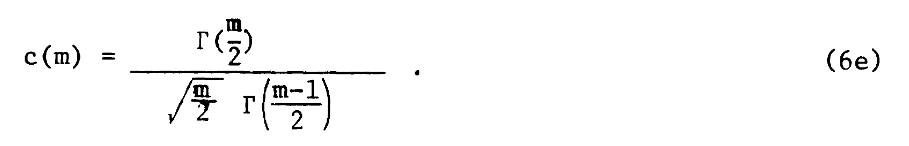
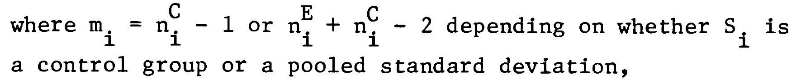

```{r setup, include=FALSE}
knitr::opts_chunk$set(echo = FALSE, message = FALSE, warning = FALSE, fig.width = 16, fig.height = 12, cache = TRUE)
library(tidyverse)
library(flextable)
library(janitor)
library(holodeck)  # for tidyverse sympathetic simulation
library(CECPfuns)
library(esc)
library(sn)

### set ggplot defaults
theme_set(theme_bw())
theme_update(plot.title = element_text(hjust = .5),
             plot.subtitle = element_text(hjust = .5),
             text = element_text(size = 24))
```
```{r, xaringanExtra-clipboard, echo=FALSE}
htmltools::tagList(
  xaringanExtra::use_clipboard(
    button_text = "<i class=\"fa fa-clone fa-2x\" style=\"color: #301e64\"></i>",
    success_text = "<i class=\"fa fa-check fa-2x\" style=\"color: #90BE6D\"></i>",
    error_text = "<i class=\"fa fa-times fa-2x\" style=\"color: #F94144\"></i>"
  ),
  rmarkdown::html_dependency_font_awesome()
)
```
This all started when I told a co-author, completely wrongly, that Hedges's *g* only applied for between groups effect estimation: oops.  In fact *g* corrects for bias in d: the tendency for *d* to overestimate population effect size particularly at smaller sample sizes.  That's true whether the *d* is a between groups *d* or a within subjects *d*.  (There are several ways of getting *d* for within subjects effects that can give rather different values but that's for another post.)  

I have found the literature on this rather confusing and sometimes contradictory and I do hate it when I feel I don't understand correctly something statistical and find that I might be giving misleading information.  Hence this odyssey into *g* using simulations to check what I am saying.

First a bit of terminology: *g* is sometimes described as a correction to *d* and sometimes as an alternative effect size measure.  I don't think it really matters how you describe it but I do think we should use *g* not *d*. However, I see things saying *d* is wrong and that *g* should be used instead even though dataset sizes are such that the difference between *g* and *d* is tiny and probably far smaller than the likely impact of all the other things likely to make generalisation suspect.  That seems an example of the methodolatry and fetishizing of theory over practicality that we get in the psycho realms.  But onwards!

This breaks into five sections from here on.

1. What is Cohen's *d*?  And, for the between groups comparison, are there two versions? (All of what follows explores two group, between group effect sizes not the repeated measures *d* or *g*.)

2. The relationship between Hedges's *g* and Cohen's *d*.  This addresses that most software uses approximations.  It also took me to what I thought was a mistake in Wikipedia but turns out to be a typo on Hedges's original paper.

3. Showing that Cohen's *d* does overestimate a population effect size.

4. This means that if you are reading articles and some use *d* and some use *g* you may want to convert from *d* to *g* to make all the values comparable.  For single values, assuming you have the *n* you can do that using one of [my shiny apps](https://shiny.psyctc.org/index.html). The specific one is [here](https://shiny.psyctc.org/apps/g_from_d_and_n/).

5. Further explorations of *g*: 

  + showing that the differences between *d* and *g* are small at reasonable sample sizes.
  
  + showing that there are three ways of getting *g*: 
  
    + an accurate (for equal sized, homoscedastic Gaussian distributions) version that is computationally expensive so not used
    
    + an approximation proposed by Hedges in his original paper on *g*...
    
    + ... and another that is slightly but clearly less good and I think should not be used.
  
  + showing that between groups *g* is fairly robust to unequal sample sizes ...
  
  + ... but more affected by heteroscedasticity and by marked deviation from Gaussian distributions.
  
# Starting point: what is Cohen's *d*?

There are lots of good explanations of this around the internet but for a two group, between group comparison it is simply the difference in the means between the two groups divided by the "common standard deviation". This is a very general idea about effect sizes: a effect, here the mean difference, is scaled in terms of a standard deviation.

As an equation that this:

$$ d = \frac{mean_{1} - mean_{2}}{SD_{pooled}} $$

and the common SD is the weighted average of the SDs. It's "common" not "pooled": pooled would be simply the SD across the pooled data from both samples but that will include variance due to any group mean differences which we want to convert to an effect size so the pooled SD is not useful here.

Actually, it's slightly more complicated than that, and this is where we come to there being two versions.

One defines the pooled SD as:

$$ SD_{pooled} = \sqrt{\frac{(n_{1}-1)SD_{1}^{2} + (n_{2}-1)SD_{2}^{2}}{n_{1} + n_{2} - 2}} $$

If the two groups are of the same size that collapses to this:

$$ SD_{pooled} = \sqrt{\frac{SD_{1}^{2} + SD_{2}^{2}}{2}} $$

i.e. the common standard deviation is the square root of the mean of the two variances.

The other definition has the pooled SD as 

$$ SD_{pooled} = \sqrt{\frac{(n_{1}-1)SD_{1}^{2} + (n_{2}-1)SD_{2}^{2}}{n_{1} + n_{2}}} $$

i.e. without subtracting 1 from each of the sample sizes.  This seems to be a rather messy area and it appears to lead off into statistical theory about least squares *versus* maximum likelihood (ML) estimation which is over my head but we can see that by *n* = 20 the impact of this choice on the estimated *g* value will be down to 10% and by 200 it's down to 1%.  In my simulations (below) the first approach seemed clearly better at approximating to the population effect size. 

## A simple, single simulation

So what does this mean?  Here's an example of scores from two datasets, one *n* = 350, the other *n* = 900.

```{r illustration1, layout="l-body-outset"}
effectSize <- .5
sampSizes <- c(350, 900)
set.seed(1234)
tibble(group = 1:2) %>% # grouping variable
  mutate(sampSize = if_else(group == 1, sampSizes[1], sampSizes[2])) %>%
  rowwise() %>%
  mutate(obsID = list(1:sampSize)) %>%
  unnest(obsID) %>%  
  group_by(group) %>%
  sim_discr(n_vars = 1, var = 1, cov = 0, group_means = c(0, effectSize), name = "score") %>%
  ungroup() %>%
  mutate(facGroup = factor(group)) %>%
  rename(score = score_1) -> tibIllustration1

tibIllustration1 %>%
  group_by(facGroup) %>% 
  reframe(n = n(),
          CI = list(getBootCImean(score)),
          sd = sd(score)) %>%
  unnest_wider(CI) -> tibStats


vecColours <- c("1" = "blue", "2" = "red")
ggplot(data = tibIllustration1,
       aes(x = score, group = facGroup, fill = facGroup)) +
  geom_histogram(alpha = .6) +
  geom_vline(data = tibStats,
             aes(xintercept = obsmean,
                 colour = facGroup)) +
  scale_color_manual("Group",
                     values = vecColours) +
  scale_fill_manual("Group",
                     values = vecColours) +
  ggtitle("Histogram of two group illustration data",
          subtitle = "Vertical lines mark group mean scores")
```

Here are the sample statistics including the 95% confidence limits around the observed mean value in each group (LCLmean and UCLmean).

```{r groupStats}
tibStats %>%
  flextable() %>%
  autofit() %>%
  colformat_double(digits = 3)
```

Here are the same data as a violin plot with the means marked again.

```{r illustration2, layout="l-body-outset"}
tibIllustration1 %>%
  summarise(mean = mean(score)) %>%
  pull() -> tmpMean

ggplot(data = tibIllustration1,
       aes(x = facGroup, y = score, group = facGroup, fill = facGroup)) +
  geom_violin(scale = "count",
              alpha = .6) +
  geom_hline(yintercept = tmpMean,
             linetype = 3) +
  geom_linerange(data = tibStats,
                 inherit.aes = FALSE,
                 aes(x = facGroup, ymin = LCLmean, ymax = UCLmean)) +
  geom_point(data = tibStats,
                 inherit.aes = FALSE,
                 aes(x = facGroup, y = obsmean)) +
  xlab("Group") +
  scale_fill_manual("Group",
                     values = vecColours) +
  ggtitle("Violin plot of two group illustration data",
          subtitle = paste0("Horizontal reference line marks overall mean score",
                            "\nPoints and error bars mark means and 95% bootstrap CI(means)"))
```

The 95% confidence intervals for the means there are very tight, non-overlapping and neither overlaps the overall mean.  Clearly these two samples are very different: this is a hugely statistically significant difference suggesting that it's highly unlikely that they arose by random sampling from populations which actually share the same mean value.  Here are the sample statistics.

```{r illustration3, layout="l-body-outset"}
tibStats %>%
  select(-c(LCLmean, UCLmean)) %>%
  rename(mean = obsmean) %>%
  flextable() %>%
  colformat_double(digits = 3)

getCommonSD <- function(SD1, SD2, n1, n2){
  numerator <- (n1 - 1)*SD1^2 + (n2 - 1)* SD2^2
  sqrt(numerator / (n1 + n2 - 2))
}
  
tibStats %>% 
  select(-c(LCLmean, UCLmean)) %>%
  rename(group = facGroup) %>%
  rename(mean = obsmean) %>%
  pivot_wider(names_from = group, values_from = c(mean, sd, n)) %>%
  rowwise() %>%
  mutate(commonSD = getCommonSD(sd_1, sd_2, n_1, n_2),
         CohenD = (mean_2 - mean_1) / commonSD,
         HedgesG = hedges_g(CohenD, n_1 + n_2)) %>%
  ungroup() -> tibResults

tibResults %>% 
  select(CohenD) %>%
  pull() -> tmpCohenD

tibResults %>% 
  select(commonSD) %>%
  pull() -> tmpCommonSD

tibIllustration1 %>%
  summarise(SDall = sd(score)) %>%
  pull() -> tmpSDall

```

Of course we're not interested in the statistical significance of the difference in means, what we want to know is the effect size.  We can see that the SD for each group is pretty close to 1.0 (the population SDs as it happens).  The common SD is 
`r round(tmpCommonSD, 3)`.  As noted above, this is *not* the SD if we pool across all the data from the two groups, that's quite a bit higher at
`r round(tmpSDall, 3)` because that difference in means between the groups contributes to that SD across the pooled data.

The difference between the means is
`r round(tibResults$mean_2 - tibResults$mean_1, 3)` so Cohen's *d* is this divided by the common SD, it's 
`r round(tmpCohenD, 3)`.

I hope that gives a sense of Cohen's *d* and why it's a not unreasonable measure of effect size.  Now we come to Hedges's *g*.

# Showing that *d* overestimates the population effect size

```{r simulation1}
startTime <- proc.time()
effectSize <- .5
maxReps <- 10000
sampSizes <- 5:50 * 10
nSampSizes <- length(sampSizes)
set.seed(12345)
tibble(group = 1:2) %>% # grouping variable
  mutate(sampSize = list(sampSizes), # generate sample sizes
         repN = list(1:maxReps)) %>% # replications for each sample size
  unnest_longer(sampSize) %>%
  unnest_longer(repN) %>%
  rowwise() %>%
  mutate(obsID = list(1:sampSize)) %>%
  unnest(obsID) %>%  
  group_by(group) %>%
  sim_discr(n_vars = 1, var = 1, cov = 0, group_means = c(0, effectSize), name = "score") %>%
  rename(score = score_1) %>%
  pivot_wider(names_from = group, values_from = score, names_prefix = "scoreInGroup") %>% 
  # mutate(diff = scoreInGroup2 - scoreInGroup1) %>%
  group_by(sampSize, repN) %>% 
  reframe(n = n(),
          mean1 = mean(scoreInGroup1),
          sd1 = sd(scoreInGroup1),
          mean2 = mean(scoreInGroup2),
          sd2 = sd(scoreInGroup2)) %>%
  rowwise() %>%
  mutate(commonSD = sqrt((sd1^2 + sd2^2) / 2),
         CohenD = (mean2 - mean1) / commonSD,
         HedgesG = hedges_g(CohenD, 2 * sampSize)) %>%
  ungroup() -> tibResults
endTime <- proc.time()
elapsedTime <- endTime - startTime
# elapsedTime
```

What I have done is to generate 
`r prettyNum(maxReps, big.mark = ",")` sets of two equal sized samples, with the sample sizes  from 50 to 500 (in steps of 10).  I sampled from Gaussian populations where the SD is 1 for both groups and the mean score of the first group is zero and for the other is 
`r round(effectSize, 1)`, so the population effect size whose formula is 

$$ \delta = \frac{\mu_{1} - \mu_{2}}{\sigma} $$

with the lower case Greek letters marking that this is the population not the sample and \(\delta\) meaning the population effect size, \(\mu\) indicating a population mean and \(\sigma\) the population standard deviation which is the same for both samples here.  So the population effect size here is 
`r round(effectSize, 1)` for all samples.  Using Gaussian distributions makes the simulation easy and means that the distributions fit the theory used to derive the correction from *d* to *g* but of course effect size estimations are used for all sorts of real world distributions.

Across all 
`r prettyNum(maxReps, big.mark = ",")`
replications at each sample size, i.e. a across a grand total of 
`r prettyNum(maxReps * nSampSizes, big.mark = ",")` simulated pairs of samples we see these summary statistics.

```{r simulation2, layout="l-body-outset"}
tibResults %>% 
  summarise(mean1 = mean(mean1), 
            mean2 = mean(mean2), 
            meanSD1 = mean(sd1), 
            meanSD2 = mean(sd2),
            meanCohenD = mean(CohenD),
            meanHedgesG = mean(HedgesG)) -> tibMeanStats

tibMeanStats %>% 
  pivot_longer(cols = everything()) %>%
  flextable() %>%
  colformat_double(digits = 4)
```

That shows that the simulation is working well with the means and SDs very close to what we want (thanks to the `sim_discr()` function from the R package holodeck). Summarising across so many sample sizes, including so many quite large ones makes the difference between *d* and *g* look meaningless there but when we show it against sample size the issue is clear.  Here the dotted horizontal line is the true population effect size.

```{r simulation3, layout="l-body-outset"}
tibResults %>%
  pivot_longer(cols = CohenD : HedgesG, names_to = "Measure") %>%
  mutate(Measure = case_when(
    Measure == "CohenD" ~ "Cohen's d",
    Measure == "HedgesG" ~ "Hedges's g")) -> tibResultsLong

suppressMessages(tibResultsLong %>%
                   group_by(sampSize, Measure) %>%
                   summarise(CI = list(getBootCImean(value))) %>%
                   unnest_wider(CI) %>%
                   ungroup() -> tibResCIs)

valXdodge <- 5
ggplot(data = tibResCIs,
       aes(x = sampSize, y = obsmean, colour = Measure, group = Measure)) +
  geom_point(position = position_dodge2(width = valXdodge)) +
  geom_line(position = position_dodge2(width = valXdodge)) +
  geom_hline(yintercept = .5,
             linetype = 3) +
  geom_linerange(aes(ymin = LCLmean, ymax = UCLmean),
                 position = position_dodge2(width = valXdodge)) +
  scale_x_continuous("Sample size",
                     breaks = seq(0, 500, 50)) +
  scale_y_continuous("Value of measure",
                     breaks = seq(.49, .51, .001)) +
  ggtitle("Cohen's d and Hedges's g against sample size",
          subtitle = paste0("Vertical error bars are 95% bootstrap CIs",
                            "\nPopulation effect size is  ",
                            effectSize,
                            ", ",
                            prettyNum(maxReps, big.mark = ","),
                            " replications for each sample size")) +
  labs(caption = "The different measures are nudged slightly to prevent overprinting")
```

As the title says, each point marks the mean *d* from the 
`r prettyNum(maxReps, big.mark = ",")`
for each the sample size (equal sized *per* group sizes are on the x axis).  The red points are Cohen's *d* and the blue are Hedges's *g* and the vertical lines through the points are the bootstrap 95% confidence intervals for those means from the 
`r prettyNum(maxReps, big.mark = ",")`
replications. The points and lines are nudged slightly on the x axis to avoid overprinting making it hard to see the differences.

That shows pretty clearly that *d* is overestimating the population effect size and much more so at the smaller sample sizes (per group sample sizes).  The values for the simulations for each sample size go up and down with a very similar profile because *g* is a near linear transform of *d.*   One important thing to notice about this is that as the sample sizes increase the differences between the two measures become very small which can be seen even more clearly in this table of the mean values for each sample size.

```{r simulation6}
tibResCIs %>%
  select(-c(LCLmean, UCLmean)) %>%
  pivot_wider(id_cols = sampSize, names_from = Measure, values_from = obsmean) %>%
  mutate(sampSize = as.integer(sampSize)) %>%
  flextable() %>%
  colformat_double(digits = 3)
```

I find it hard to believe that any data about psychosocial interventions needs to worry about whether a sample statistic is less biased than say 1% out so I think that for *n* > 60 we really don't care about the difference between *d* and *g* and I think that for any real world data from this field other issues about inevitable sample biases make the whole idea of getting very accurate population estimates pretty silly.  For all that Hedges was clearly correct about correcting the bias in *d* we are looking at an academic distinction not a real world issue.  However, I got hooked on exploring this more!

# So what is the transform that converts a Cohen's *d* value to a Hedges's *g* value?

Hedges's *g*, which was first presented in:

Hedges, L. V. (1981). Distribution Theory for Glass’s Estimator of Effect size and Related Estimators. Journal of Educational Statistics, 6(2), 107–128. https://doi.org/10.3102/10769986006002107 

corrects this bias in Cohen's *d*.  You can call that a correction or a better index of the effect size, I really can't see that matters: either way the terminology is about seeing it as an estimate of a population value not as a sample statistic.

As that simulation shows, the correction is necessary because Cohen's *d* from sample data simply *is* a biased estimator of population effect size.  This is true whether the data are between group or within subject contrasts.  The bias decreases with increasing sample size and with quite large *n* the difference is completely trivial.  But what is the transform?  This took me down a bit of a rabbit hole!

Managing to get that original paper off the internet (thanks JSTOR) started me on this adventure (or rabbit hole: it ended up feeling very much the latter but, as you will see, I was hooked).

I read that paper, to the extent that I could follow it. I wasn't helped by the fact the paper looks as if it was typed on a good old monospaced font typewriter.  That took me back.  I think I taught myself to touch type on one of these in 1981:

Selling for £150 now apparently.  I think I paid £15 for mine second hand and I gave it away long ago!  Actually, the paper must have been typed on something more sophisticated than but the font is the same old typewriter Courier fixed width font and in places there are hand annotations to get the formulae that Hedges wanted.  

The accurate equation that corrects for the bias was shown by Hedges to be this:



with the explanation:



(I will come back to that but for now m is the combined sample size.)

By the miracles of modern LaTeX I can write that more elegantly as:

$$c(m) = \frac{\Gamma(\frac{m}{2})}{\sqrt{\frac{m}{2}}\Gamma(\frac{m-1}{2})}$$

and, still without understanding it, let alone being able to follow Hedges's proof, I can convert into an R function:

```
getJ <- function(x){
  gamma(x / 2) / (sqrt(x / 2 ) * gamma((x - 1) / 2))
}
```

I have used "J" there as a lot of more recent papers and web pages seem to use where Hedges used "c(m")".

That function, with its gamma functions (no, I don't know what they are) is accurate but very computationally expensive so Hedges's original work in FORTRAN would have been slow on the then University of Chicago mainframe (IBM 360 and 370 machines would have been common university machines then with perhaps 32kb of memory).  

OK Christopher, enough technological history!

That led him to find an approximation that didn't need the gamma function and could be computed easily even on the hardware that was around then.  In the paper it is


What puzzled me was that many things I saw had that as

$$ c(m) = 1 - \frac{3}{4m - 9} $$

with "- 9" instead of "- 1". Another discovery was that other things talked about a different approximation, down to Durlak or to Hunter & Schmidt:

$$ c(m) = \frac{m-3}{m-2.25}\sqrt{\frac{m-2}{m}} $$

so in R code:

```
getDurlakG <- function(G, totN) {
  G * ((totN - 3) / (totN - 2.25)) * sqrt((totN - 2) / totN)
}
```

So I decided that I had to do some simulating to see which approximation was best.

This next block of code creates the simulations, each of two samples from Gaussian populations where the population effect sizes change across simulations as do the sample sizes and now I have added a simulation variable of sample size asymmetry, i.e. whether the two samples are equal in size or different.

```{r simulate1}
set.seed(12345) # to get replicable outputs
nSims <- 5000 # to get good stability across replications of the simulations
procTime1 <- proc.time() # just checking timing
### this is my way of doing simulations now using pretty basic tidyverse
tibble(simulnN = list(1:nSims), # to create nSims separate simulations for each set of population parameters below
       popMean2 = list(c(0, seq(.1, .9, .2))), # create these mean differences (will be the same as the population effect sizes)
       n1 = list(seq(10, 60, 10)), # will simulate sizes of the first sample of 10, 20, 30, 40, 50 and 60
       asymm = list(seq(1:3))) %>% # I wanted to look both at equal sample sizes and "asymmetrical" sizes so this will make n2 = 2 or 3x n1 in what follows
  ### these lines just "unnest" those parameter values to create a very long tibble (dataset of 5000 * 5 * 6 * 3 = 450,000 rows one for each simulation)
  unnest_longer(simulnN) %>%
  unnest_longer(popMean2) %>%
  unnest_longer(n1) %>%
  unnest_longer(asymm) %>%
  ### now create n2 and totN (m in the text above)
  mutate(n2 = n1 * asymm,
         totN = n1 + n2) %>%
  ### go to rowwise do do things, well, ... rowwise (otherwise dplyr would try to handle each variable as a vector)
  rowwise() %>%
  mutate(samp1 = list(rnorm(n1, 0, 1)), # generate the first sample data
         samp2 = list(rnorm(n2, popMean2, 1)), # and the second
         ### get some sample statistics
         sampMean1 = mean(samp1),
         sampMean2 = mean(samp2),
         sampSD1 = sd(samp1),
         sampSD2 = sd(samp2)) %>%
  # ungroup() takes us out of rowwise processing and I export the tibble to tibSims
  ungroup() -> tibSims
### finding out how long that all took
procTime2 <- proc.time()
elapsed1 <- procTime2 - procTime1
```

Then this block of code uses those samples to get various statistics for each, including various ways of getting *g*.

```{r getStats1}
### define some functions to process all those simulations
getPooledSD <- function(n1, sd1, n2, sd2) {
  sqrt((((n1 - 1) * sd1 * sd1 ) + ((n2 - 1) * sd2 * sd2)) / (n1 + n2))
}
# getPooledSD(10, 1, 20, 5)

getPooledSD2 <- function(n1, sd1, n2, sd2) {
  sqrt((((n1 - 1) * sd1^2 ) + ((n2 - 1) * sd2^2)) / (n1 + n2 - 2))
}
# getPooledSD2(10, 1, 20, 5)

unadjG <- function(mean1, n1, sd1, mean2, n2, sd2) {
  (mean2 - mean1) / getPooledSD2(n1, sd1, n2, sd2)
}
# unadjG(0, 10, 1, 1, 20, 5)

getJ <- function(x){
  gamma(x / 2) / (sqrt(x / 2 ) * gamma((x - 1) / 2))
}
# getJ(2)

getDurlakG <- function(G, totN) {
  G * ((totN - 3) / (totN - 2.25)) * sqrt((totN - 2) / totN)
}

getHedgesG1 <- function(G, totN) {
  G * (1 - (3 / (4 * totN - 1)))
}

getHedgesG9 <- function(G, totN) {
  G * (1 - (3 / (4 * totN - 9)))
}

procTime3 <- proc.time()
tibSims %>% 
  rowwise() %>% # rowwise processing again
  mutate(pooledSD = getPooledSD(n1, sampSD1, n2, sampSD2),
         pooledSD2 = getPooledSD2(n1, sampSD1, n2, sampSD2),
         unadjG = unadjG(sampMean1, n1, sampSD1, sampMean2, n2, sampSD2), # get uncorrected g (not really g)
         compJG = getJ(totN - 2) * unadjG, # use the acccurate but computationally costly correction to that
         durlakG = getDurlakG(unadjG, totN), # get Durlak's correction
         hedgesG1 = getHedgesG1(unadjG, totN), # get Hedges's correction as per original paper
         hedgesG9 = getHedgesG9(unadjG, totN), # get the correction with 9 instead of 1
         DescToolsD = DescTools::CohenD(samp2, samp1)[1], # d from the DescTools package
         DescToolsG = DescTools::CohenD(samp2, samp1, correct = TRUE)[1], # g from ditto
         effsizeD = effsize::cohen.d(samp2, samp1)$estimate, # d from the effsize package
         effsizeG = effsize::cohen.d(samp2, samp1, hedges.correction = TRUE)$estimate, # g from ditto
         ### and finally g from the esc package
         escG = esc::hedges_g(DescToolsD, totN)) %>% 
  ### ungroup and save
  ungroup() -> tibStats
### timing again for my amusement
procTime4 <- proc.time()
elapsed2 <- procTime4 - procTime3
```

Here are the top 10 rows of tibStats (after sorting them into more sensible row order).  I am just using the raw way that R prints a tibble as it shows the list variables samp1 and samp2.

```{r sortTibStats}
tibStats %>%
  arrange(popMean2, n1, n2, simulnN) -> tibStats

tibStats
```

I have traded typographic elegance to get "metadata" about the structure of the dataset.  That shows that the variable `samp1` is a vector of, in these rows, length 10 (it is that length because the single value variable `n1` has value 10, later in the huge dataset, as `n` gets larger, so `samp1` gets to be a longer vector).  I like this way that you can pack varying length vectors into a dataset, technically a "tibble".  (R data frames and tibbles both store these variables with length greater than 1 as "lists" so can actually be much more sophisticated structures than simple vectors.  This freedom allows us to create very regular ("tidy") datasets but with great flexibility for things like simulation. 

OK, that's just showing the workings.  This next table is aesthetically cleaner (thanks `flextable()`) and gives a more interesting look showing the sample statistics from the first ten rows.

```{r tibStats1}
tibStats %>%
  filter(row_number() <= 10) %>% # just first ten rows
  select(simulnN : totN, sampMean1 : pooledSD2) %>%
  flextable() %>%
  autofit() %>%
  colformat_double(digits = 2)
```

That shows that the first ten simulations of the
`r prettyNum(nSims, big.mark = ",")`
for n1 = n2 = 10 (hence asymm = 1) with those simulation variables (`popMean2`, `n1` and `asymm`, and then `n2` and `totN` which follow from those three.  Then it shows the values of the sample statistics for each simulation: `sampMean1` to `pooledSD2`.  You can see that the values of those means and SDs are flailing around a lot as you would expect them to with such small samples.

Why `pooledSD` and `pooledSD2`?  This is about the issue noted much earlier about whether you compute the pooled SD as:

$$ SD_{pooled} = \sqrt{\frac{(n_{1}-1)SD_{1}^{2} + (n_{2}-1)SD_{2}^{2}}{n_{1} + n_{2} - 2}} $$

or as:

$$ SD_{pooled} = \sqrt{\frac{(n_{1}-1)SD_{1}^{2} + (n_{2}-1)SD_{2}^{2}}{n_{1} + n_{2}}} $$

You can see that `pooledSD2` is the first of those as it's always larger than `pooledSD`.  I didn't actually pursue this as I think most work on *g* uses the first equation.

Here is a plot of what that gives us.

```{r plotting1, fig.height=16, layout="l-body-outset"}
ggplot(data = filter(tibStats,
                     asymm == 1),
       aes(x = popMean2, y = escG, group = popMean2)) +
  facet_grid(rows = vars(n1)) +
  geom_violin() +
  geom_hline(yintercept = 0, 
             linetype = 3) +
  geom_point(aes(y = popMean2, group = popMean2),
             colour = "green",
             size = 3,
             linewidth = 2) +
  geom_abline(aes(intercept = 0, slope = 1),
              colour = "green",
              linewidth = 2) +
  ylab("Hedges's g") +
  scale_x_continuous("Population group mean difference",
                     breaks = c(0, seq(.1, .9, .2))) +
  ggtitle(str_c("Facetted violin plot of Hedges's g (from esc package) against population effect size",
                "\nfacetted by first sample size, symmetric case so n1 = n2)"),
          subtitle = str_c("Green points mark population effect size, dotted horizontal line marks zero",
                           "sloping green line is leading diagonal, equality: y = x"))
```

That is really more of my showing my working and checking to see whether the simulation results look as they should.  Reading the top facet first and left to right, the first violin (of the *g* values from
`r prettyNum(nSims, big.mark = ",")`)
simulations looks from the green point to have mean *g* of zero as it should.  Its shape looks fairly Gaussian as I would have expected (not sure I can 100% justify that but plausible). 

Then going across that facet the mean observed *g* values go up and the solid green line says that they go up pretty much as they should from .1 to .9.  Reading down the facets it looks pretty clear that the scatter of the observed *g* values gets tighter as the sample sizes go up from 10 to 60, as of course they should. 

All reassuring, it certainly looks as if the simulation is working so let's see we have answers to my questions from this.  So what are my questions at this point?

* Do the various ways of getting *d* and *g* from R packages give matching values?  (Should be a "yes"!)
* Which formula for the pooled SD are they using?
* Which correction formula are they using to get  *g*?
* Is the "- 1" in the original Hedges paper a typo which should have been "- 9"?
* Is the computationally expensive gamma formula for the population *g* getting very close to the true population value?
* How do the other correction formulae compare with each other and with the true population value?
* Are the findings affected by unequal sample sizes?
* Is the transform from *d* to *g* affected by non-Gaussian population distributions?

## Do the various ways of getting *d* and *g* from R packages give matching values?  (Should be a "yes"!)

### Cohen's *d*

Let's start with *d*.  The variable `unadjG` that I created is actually my computation of *d* (`unadjG` as it is the starting point to get *g* by transforming *d*).  This shows the mean squared differences between the variables broken down by the simulation parameters.

```{r q1a}
tibStats %>%
  mutate(DescToolsD_v_unadjG = (DescToolsD - unadjG)^2,
         DescToolsD_v_effsizeD = (DescToolsD - effsizeD)^2,
         effsizeD_v_unadjG = (effsizeD - unadjG)^2) %>%
  select(simulnN : totN, unadjG, DescToolsD, effsizeG, starts_with("DescToolsD_"), effsizeD_v_unadjG) -> tmpTib

tmpTib %>%
  group_by(popMean2, n2) %>%
  summarise(meanDescToolsD_v_unadjG = mean(DescToolsD_v_unadjG),
            meanDescToolsD_v_effsizeD = mean(DescToolsD_v_effsizeD),
            meanEffsizeD_v_unadjG = mean(effsizeD_v_unadjG)) %>%
  ungroup() -> tmpTib2

tmpTib2 %>% 
  mutate(meanDescToolsD_v_unadjG = formatC(meanDescToolsD_v_unadjG, format = "e", digits = 2),
         meanDescToolsD_v_effsizeD = formatC(meanDescToolsD_v_effsizeD, format = "e", digits = 2),
         meanEffsizeD_v_unadjG = formatC(meanEffsizeD_v_unadjG, format = "e", digits = 2)) %>%
  as_grouped_data(groups = "popMean2") %>%
  flextable()
```

Clearly `effsize::cohen.d()` is using the same method to get *d* as I have and `DescTools::CohenD()` is doing things slightly differently but we can see that the differences here are tiny.  R is using scientific notation there to squeeze things in. So the first row there for `meanDescToolsD_v_unadjG`, i.e. the mean squared difference between the result from `DescTools::CohenD()` and that from `effsize::cohen.d()` is the mean  across all the 
`r nSims` 
simulations for a zero population difference and both samples of size 10: "1.57e-33". In ordinary representation that is 0.000,000,000,000,000,000,000,000,000,000,001,572.  That is totally unimportant and differences like that can occur if different methods are used to do the same thing simply because computers don't work to infinite precision.

### Hedges's *g*

```{r q1b}
tibStats %>%
  mutate(DescToolsG_v_effsizeG = (DescToolsG - effsizeG)^2,
         DescToolsG_v_escG = (DescToolsG - escG)^2,
         effsizeG_v_escG = (effsizeG - escG)^2) %>%
  select(simulnN : totN, unadjG, DescToolsG, effsizeG, escG, starts_with("DescToolsG_"), effsizeG_v_escG) -> tmpTib

tmpTib %>%
  group_by(popMean2, n2) %>%
  summarise(meanDescToolsG_v_effsizeG = mean(DescToolsG_v_effsizeG),
            meanDescToolsG_v_escG = mean(DescToolsG_v_escG),
            meanEffsizeG_v_escG = mean(effsizeG_v_escG)) %>%
  ungroup() -> tmpTib2

tmpTib2 %>% 
  mutate(meanDescToolsG_v_effsizeG = formatC(meanDescToolsG_v_effsizeG, format = "e", digits = 2),
         meanDescToolsG_v_escG = formatC(meanDescToolsG_v_escG, format = "e", digits = 2),
         meanEffsizeG_v_escG = formatC(meanEffsizeG_v_escG, format = "e", digits = 2)) %>%
  as_grouped_data(groups = "popMean2") %>%
  flextable()
```

OK, so they all agree for all simulations so `esc::hedges_g()`, gets the same values as `effsize::cohen.d()` (with "hedges.correction = TRUE") and the same as `DescTools::CohenD()` with "correct = TRUE") so they are all using the same formula if perhaps slightly different computation.

Looking at the code where I most easily could (`esc::hedges_g()` is the simplest) I could see that the formula they are using is:

$$ c(m) = 1 - \frac{3}{4m - 9} $$

## Which formula for the pooled SD are they using?

This is easy to answer now.  My code for `unadjG` was:

```
getPooledSD2 <- function(n1, sd1, n2, sd2) {
  sqrt((((n1 - 1) * sd1^2 ) + ((n2 - 1) * sd2^2)) / (n1 + n2 - 2))
}

unadjG <- function(mean1, n1, sd1, mean2, n2, sd2) {
  (mean2 - mean1) / getPooledSD2(n1, sd1, n2, sd2)
}
```

I was using 

$$ SD_{pooled} = \sqrt{\frac{(n_{1}-1)SD_{1}^{2} + (n_{2}-1)SD_{2}^{2}}{n_{1} + n_{2} - 2}} $$ 

and I got the same *d* as from the code in the DescTools and the effsize packages so that's what they are using.


## Which correction formula are they using to get  *g*?

I think we can start to answer this just looking at raw computed values from the different methods for the first ten simulations.

```{r q4a}
tibStats %>%
  filter(row_number() < 11) %>%
  select(simulnN : totN, compJG, durlakG, hedgesG1, hedgesG9, escG) %>%
  flextable()
```

Well we can see that `esc::hedges_g()` which created `escG` is getting the same as my 'hedgesG9".  As we know that `esc::hedges_g()` gets essentially the same *g* as from `effsize::cohen.d()` and from `DescTools::CohenD()` we can tell they are all using the 

$$ c(m) = 1 - \frac{3}{4m - 9} $$

equation.

We can see clearly that the `compJG` which is getting *g* using the computationally expensive gamma formula is giving slightly different results from those, but only slightly different but sufficiently different that we can see that's not the method they are using.  We can also see that they are not using the Durlak formula.

We can see that the results are flailing a lot around the population value of zero, as you'd expect with a very small sample size of 10.


## Is the "- 1" in the original Hedges paper a typo which should have been "- 9"?

The findings in that last section are very clear: **Yes!**


## Is the computationally expensive gamma formula for the population *g* getting very close to the true population value?

This shows the mean deviation of those *g* values from the true population values, i.e. any bias in the estimates.  I have restricted to the symmetrical simulations, i.e. n1 == n2.

```{r q6a}
tibStats %>%
  filter(asymm == 1) %>%
  select(simulnN : totN, compJG, durlakG, hedgesG9) %>%
  group_by(popMean2, n2) %>%
  summarise(mean_dev_gamma = mean(popMean2 - compJG),
            mean_dev_durlak = mean(popMean2 - durlakG),
            mean_dev_hedges9 = mean(popMean2 - hedgesG9)) %>%
  ungroup() -> tmpTib

tmpTib %>%
  select(n2, popMean2, mean_dev_gamma) %>%
  as_grouped_data(groups = "popMean2") %>%
  flextable()
```

I am slightly surprised that these are not closer to the population values but it is clear that they are good enough estimation, we never need *g* to more than three decimal places.  I suspect also that these are sampling vagaries even across 
`r nSims`
simulations and that if I pushed the number of simulations up much higher the differences would be smaller.

What happens if I ignore `n2` and just summarise by the population effect size?

```{r q6b}
tibStats %>%
  filter(asymm == 1) %>%
  select(simulnN : totN, compJG, durlakG, hedgesG9) %>%
  group_by(popMean2) %>%
  summarise(mean_dev_gamma = mean(popMean2 - compJG),
            mean_dev_durlak = mean(popMean2 - durlakG),
            mean_dev_hedges9 = mean(popMean2 - hedgesG9)) %>%
  ungroup() -> tmpTib2

tmpTib2 %>%
  select(popMean2, mean_dev_gamma) %>%
  flextable() %>%
  autofit() %>%
  colformat_double(j = 2, digits = 5)
```

OK, so really no systematic bias of any meaningful size there.

## How do the other correction formulae compare with each other and with the true population value?

Here are the bias values for all the methods, again, symmetrical simulations only.

```{r q7a}
tmpTib %>%
  select(popMean2, n2, starts_with("mean_dev")) %>%
  mutate(n2 = as.integer(n2)) %>%
  as_grouped_data(groups = "popMean2") %>%
  flextable() %>%
  colformat_double(digits = 5) %>%
  colformat_double(j = 1, digits = 1)
```

Hm.  Quite hard to digest that though it looks as Hedges's method is consistently closer to the gamma method than is the method of Durlak.  What if I take mean values across all values of `n2`?

```{r q7b}
tmpTib %>% 
  select(popMean2, n2, starts_with("mean_dev")) %>%
  group_by(popMean2) %>%
  summarise(meanGamma = mean(mean_dev_gamma),
            meanDurlak = mean(mean_dev_durlak),
            meanHedges9 = mean(mean_dev_hedges9)) %>%
  flextable() %>%
  colformat_double(digits = 5) %>%
  colformat_double(j = 1, digits = 1)
```

That seems to show that the Durlak approximation is worse than Hedges's one and increasingly so as the population effect size goes up. It also shows that Hedges's approximation is pretty spot on to the accurate gamma method with similar negligible bias to the *g* values from that transform.

## Are the findings affected by unequal sample sizes?

```{r q8a, fig.height=16, layout="l-body-outset"}
getParamCImean <- function(x) {
  ### little function to get parametric 95% CI of the mean
  ### assumes complete data
  tmp <- t.test(x)
  return(list(obsMean = tmp$estimate,
              LCL = unlist(tmp$conf.int)[1],
              UCL = unlist(tmp$conf.int)[2]))
}

tibStats %>%
  select(simulnN : totN, compJG, durlakG, hedgesG9) %>%
  mutate(diffGamma = (popMean2 - compJG),
         diffDurlak = (popMean2 - durlakG),
         diffHedges9 = (popMean2 - hedgesG9)) %>%
  group_by(asymm, n1, popMean2) %>%
  summarise(diffGamma = list(getParamCImean(diffGamma)),
            diffDurlak = list(getParamCImean(diffDurlak)),
            diffHedges = list(getParamCImean(diffHedges9))) %>%
  ungroup() %>%
  unnest_wider(diffGamma) %>%
  rename(meanGamma = obsMean,
         LCLgamma = LCL,
         UCLgamma = UCL) %>%
  unnest_wider(diffDurlak) %>%
  rename(meanDurlak = obsMean,
         LCLDurlak = LCL,
         UCLDurlak = UCL) %>%
  unnest_wider(diffHedges) %>%
  rename(meanHedges = obsMean,
         LCLHedges = LCL,
         UCLHedges = UCL) -> tmpTib

tmpTib %>%
  pivot_longer(cols = ends_with("Gamma")) %>%
  select(asymm, n1, popMean2, name, value) -> tmpTibGamma

tmpTib %>%
  pivot_longer(cols = ends_with("Durlak")) %>%
  select(asymm, n1, popMean2, name, value) -> tmpTibDurlak

tmpTib %>%
  pivot_longer(cols = ends_with("Hedges")) %>%
  select(asymm, n1, popMean2, name, value) -> tmpTibHedges

bind_rows(tmpTibGamma,
          tmpTibDurlak,
          tmpTibHedges) %>%
  mutate(transform = if_else(str_detect(name, fixed("amma")),
                             "Gamma",
                             "Hedges"),
         transform = if_else(str_detect(name, fixed("Durlak")),
                             "Durlak",
                             transform),
         statistic = if_else(str_detect(name, fixed("mean")),
                             "mean",
                             "UCL"),
         statistic = if_else(str_detect(name, fixed("LCL")),
                             "LCL",
                             statistic)) -> tmpTib2

tmpTib2 %>%
  select(-name) %>%
  pivot_wider(id_cols = c(asymm, n1, popMean2, transform),
              values_from = value,
              names_from = statistic) %>%
  rename(`transform:` = transform) -> tmpTib3


ggplot(data = tmpTib3,
       aes(x = popMean2, y = mean, colour = `transform:`)) +
  facet_grid(cols = vars(asymm),
             rows = vars(n1),
             labeller = label_both) +
  geom_point() +
  geom_line() +
  geom_linerange(aes(ymin = LCL, ymax = UCL)) +
  geom_hline(yintercept = 0,
             linetype = 3) +
  ylab("Mean difference from population ES (bias)") +
  scale_x_continuous("Population effect size",
                     breaks = c(0, seq(.1, .9, .2))) +
  ggtitle(str_c("Mean bias, with 95% CI widths, against population effect size.",
                "\nFacetted by asymmetry (1, 2 and 3, i.e. n2 = n1, 2*n1 and 3*n1)",
                "\nand by sample size (shown for first group: n1)"),
          subtitle = "Horizontal reference line marks zero bias.") +
  theme(legend.position = "bottom")
```

As we would probably have expected from the similarity of the values from Hedges's approximation to his gamma function they overprint each other.

So asymmetry impinges on the Durlak approximation and it is more biased the more asymmetrical simulations.  However, we already know it's less good than the Hedges one so I think we can ignore the Durlak approximation from now on.  What does removing it show?

```{r q8b, fig.height=16, layout="l-body-outset"}
ggplot(data = filter(tmpTib3,
                     `transform:` != "Durlak"),
       aes(x = popMean2, y = mean, colour = `transform:`)) +
  facet_grid(cols = vars(asymm),
             rows = vars(n1),
             labeller = label_both) +
  geom_point() +
  geom_line() +
  geom_hline(yintercept = 0,
             linetype = 3) +
  geom_linerange(aes(ymin = LCL, ymax = UCL)) +
  ylab("Mean difference from population ES (bias)") +
  scale_x_continuous("Population effect size",
                     breaks = c(0, seq(.1, .9, .2))) +
  ggtitle(str_c("Mean bias, with 95% CI widths, against population effect size.",
                "\nFacetted by asymmetry (1, 2 and 3, i.e. n2 = n1, 2*n1 and 3*n1)",
                "\nand by sample size (shown for first group: n1)"),
          subtitle = "Horizontal reference line marks zero bias.") +
  theme(legend.position = "bottom")
```

It doesn't look as if asymmetry, at least up to 3:1, is hurting the bias.

```{r q8c}
tibStats %>%
  select(simulnN : totN, compJG, hedgesG9) %>%
  mutate(biasGamma = compJG - popMean2,
         biasHedges9 = hedgesG9 - popMean2) %>%
  group_by(asymm) %>%
  summarise(meanGamma = list(getParamCImean(biasGamma)),
            meanHedges9 = list(getParamCImean(biasHedges9))) %>%
  ungroup() %>%
  unnest_wider(meanGamma) %>%
  rename(meanGamma = obsMean,
         LCLgamma = LCL,
         UCLgamma = UCL) %>%
  unnest_wider(meanHedges9) %>%
  rename(meanHedges9 = obsMean,
         LCLhedges9 = LCL,
         UCLhedges9 = UCL) %>%
  flextable() %>%
  colformat_double(digits = 4)
```

OK. I think we can say that asymmetry of sample sizes up to 3:1 doesn't affect the bias of either the gamma method or Hedges's approximation. That's interesting as I thought I read somewhere that the approximation only worked well for balanced sample sizes.


## How does Hedges's *g* cope with heteroscedasticity?

So far I have been simulating samples in which both groups had the same variance/SD. That's homoscedasticity. What if the variances are different: heteroscedasticity?  What I have done here is to use the same simulations as above but to multiply the values of the first sample (with population mean zero) by 3.  That doesn't change the population mean which remains zero and it changes the population SD by multiplying it by 3 and it makes the pooled SD 
$$ \sqrt{SD_{1}^{2} + SD_{2}^{2}} = \sqrt{3^{2} + 1^{2}} = \sqrt{10} \cong{3.162278} $$ 

and that makes the population effect size here the mean difference divided by \(\sqrt{10}\).

```{r heteroscedasticity1}
tibSims %>%
  rowwise() %>%
  ### multiple by 3 the first sample values, i.e. the group with population mean of zero
  mutate(samp1 = list(3 * samp1)) %>%
  ungroup() -> tibSimsHeterosced

### now use those data
tibSimsHeterosced %>%
  rowwise() %>%
  mutate(popES = popMean2 / sqrt(10),
         sampMean1 = mean(samp1),
         sampMean2 = mean(samp2),
         sampSD1 = sd(samp1),
         sampSD2 = sd(samp2),
         pooledSD2 = getPooledSD2(n1, sampSD1, n2, sampSD2),
         unadjG = unadjG(sampMean1, n1, sampSD1, sampMean2, n2, sampSD2), # get uncorrected g, i.e. d
         hedgesG9 = getHedgesG9(unadjG, totN),
         effsizeD = effsize::cohen.d(samp2, samp1)$estimate,
         effsizeG = effsize::cohen.d(samp2, samp1, hedges.correction = TRUE)$estimate, # g from ditto
         ### and finally g from the esc package
         escG = esc::hedges_g(effsizeD, totN)) %>%
  ungroup() -> tibStatsHeterosced

tibStatsHeterosced %>%
  select(popES) %>%
  distinct() %>%
  mutate(popES = round(popES, 2)) %>%
  pull() -> tmpVecPopES
```
```{r heteroscedasticity2, fig.height=24, layout="l-body-outset"}
tibStatsHeterosced %>%
  group_by(asymm, n1, popES) %>%
  summarise(Hedges = list(getParamCImean(hedgesG9))) %>%
  ungroup() %>%
  unnest_wider(Hedges) %>%
  rename(meanG = obsMean,
         LCLG = LCL,
         UCLG = UCL) %>%
  mutate(meanBias = meanG - popES,
         LCLbias = LCLG - popES,
         UCLbias = UCLG - popES) -> tmpTib

ggplot(data = tibStatsHeterosced,
       aes(x = popES, y = hedgesG9)) +
  facet_grid(cols = vars(asymm),
             rows = vars(n1),
             labeller = label_both) +
  geom_violin(aes(group = popES)) +
  geom_point(data = tmpTib,
             aes(y = meanG)) +
  geom_hline(yintercept = 0,
             linetype = 3) +
  geom_abline(intercept = 0, slope = 1,
              colour = "green") +
  ylab("Hedges's g") +
  scale_x_continuous("Population effect size",
                     breaks = tmpVecPopES) +
  ggtitle(str_c("Heteroscedasticity: mean bias, with 95% CI widths, against population effect size.",
                "\nFacetted by asymmetry (1, 2 and 3, i.e. n2 = n1, 2*n1 and 3*n1)",
                "\nand by sample size (shown for first group: n1)"),
          subtitle = "Horizontal reference line marks zero bias, green line marks the population effect sizes.") +
  theme(legend.position = "bottom",
        axis.text.x = element_text(angle = 70,
                                   hjust = 1))
```

That looks pretty clear that *g* is overestimating the population effect size where there is one.  How does it look if we look at just the mean bias and their CIs which should give a clearer picture of the relationships.

```{r heteroscedasticity3, fig.height=24, layout="l-body-outset"}
ggplot(data = tmpTib,
       aes(x = popES, y = meanBias)) +
  facet_grid(cols = vars(asymm),
             rows = vars(n1),
             labeller = label_both) +
  geom_point() +
  geom_line() +
  geom_hline(yintercept = 0,
             linetype = 3) +
  geom_linerange(aes(ymin = LCLbias, ymax = UCLbias)) +
  ylab("Mean difference from population ES (bias)") +
  scale_x_continuous("Population effect size",
                     breaks = tmpVecPopES) +
  ggtitle(str_c("Heteroscedasticity: mean bias, with 95% CI widths, against population effect size.",
                "\nFacetted by asymmetry (1, 2 and 3, i.e. n2 = n1, 2*n1 and 3*n1)",
                "\nand by sample size (shown for first group: n1)"),
          subtitle = "Horizontal reference line marks zero bias.") +
  theme(legend.position = "bottom",
        axis.text.x = element_text(angle = 70,
                                   hjust = 1))
```

That's very clear isn't it?  No bias where there is no effect but as soon as there is a population effect there is positive bias and, unsurprisingly, it is least where the sample sizes are equal (asymm = 1) and is increased as asymmetry increases.

## Is the transform from *d* to *g* affected by non-Gaussian population distributions?

### Kurtosis

The easy way to address this that I could think of is to cube the Gaussian scores. The variance of the cubed standard Gaussian distribution is 15 (as opposed to 1 for the standard Gaussian).  Here is what the difference looks like.

```{r nonGaussian1, fig.height=16, layout="l-body-outset"}
set.seed(12345)
valN <- 50000
tibble(Gaussian = rnorm(valN)) %>%
  mutate(Cubed = Gaussian^3) -> tmpTib

tmpTib %>%
  pivot_longer(cols = Gaussian : Cubed, names_to = "Distribution") %>%
  group_by(Distribution) %>%
  summarise(min = min(value),
            mean = mean(value),
            sd = sd(value),
            var = var(value),
            max = max(value),
            kurtosis = DescTools::Kurt(value)) -> tmpTibStats 

tmpTibStats %>%
  filter(Distribution == "Cubed") -> tmpTibStats2

tibble(x = seq(floor(tmpTibStats2$min),
               floor(tmpTibStats2$max),
                     .2),
               fittedGauss = dnorm(x, mean = tmpTibStats2$mean, sd = tmpTibStats2$sd)) -> tmpTibFitted

ggplot(data = tmpTib) +
  geom_histogram(data = tmpTib,
                 aes(x = Cubed,
                     y = after_stat(density)),
                 fill = "grey",
                 bins = 100) +
  geom_line(data = tmpTibFitted,
            aes(x = x, y = fittedGauss)) +
  xlab("x") +
  ggtitle("Histogram of standard Gaussian distribution, cubed",
          subtitle = "Black curve shows the Gaussian with the same mean and SD")
```

That shows clearly how cubing the values has changed the distribution.  At first sight I always think that this is a leptokurtic distribution as it's so pointy.  However, the key thing is that the tails go out way beyond those of the standard Gaussian and are thus "heavier".

This censored histogram shows this.  Chopping the y axis allows us to the see the differences in the "shoulders" of the distribution.

```{r nonGaussian2, fig.height=16, layout="l-body-outset"}
ggplot(data = tmpTib) +
  geom_histogram(data = tmpTib,
                 aes(x = Cubed,
                     y = after_stat(density)),
                 fill = "grey",
                 bins = 100) +
  geom_line(data = tmpTibFitted,
            aes(x = x, y = fittedGauss)) +
  coord_cartesian(ylim = (c(0, .025))) +
  xlab("x") +
  ggtitle("Chopped histogram of standard Gaussian distribution, cubed",
          subtitle = "Black curve shows the Gaussian with the same mean and SD")
```

What matters statistically are those "shoulders" of the histogram that rise above that of the Gaussian distribution, and the linked fact that the range of the observed values goes out so much further than that of the standard Gaussian. Of course, both distributions in theory go  from -&infin; to +&infin; but for both distributions the probabilities of the greater absolute values are tiny.  For the standard Gaussian the probabilities of numbers outside [-5, +5] (the density values on the y axis) drop to tiny and then to infinitesimal, i.e. essentially zero. That only happens for values much further from zero for the cubed Gaussian.  Those difference are what makes the cubed standard Gaussian platykurtic despite that "spikey" mass on and near zero.  

Here are the summary statistics for this particular sample of 
`r prettyNum(valN, big.mark = ",")`
values.

```{r nonGaussian3}
tmpTibStats %>%
  ### get more logical order: Gaussian first
  arrange(desc(Distribution)) %>%
  flextable() %>%
  colformat_double(digits = 3)
```

The values that came up sampling from the standard Gaussian ranged from 
`r round(tmpTibStats2$min, 3)`
to 
`r round(tmpTibStats2$min, 3)`
but cubing creates a range from
`r round(tmpTibStats2$min, 3)`^3, 
i.e. 
`r prettyNum(tmpTibStats2$min^3, big.mark = ",")` to
`r round(tmpTibStats2$max, 3)`^3, 
i.e. 
`r prettyNum(tmpTibStats2$max^3, big.mark = ",")`.

You can see that the mean for the Gaussian is close to the population value of zero and cubing it doesn't change that much but cubing has taken the SD up to 
`r round(tmpTibStats$sd[2], 3)` and taken the variance up close to the population variance for the cubed standard Gaussian distribution of 15.

The "excess kurtosis" is huge. ("Excess kurtosis" is how much the kurtosis is above 3.0, that of any Gaussian distribution, hence the "excess kurtosis" for any Gaussian distribution is zero, hence the "excess".)

```{r useCubed}
startTime <- proc.time()
tibSims %>%
  # filter(row_number() < 11) %>%
  rowwise() %>%
  mutate(samp1 = list(unlist(samp1^3)),
         samp2 = list(unlist(samp2^3)),
         ### get new sample statistics for these cubed values
         sampMean1 = mean(samp1),
         sampMean2 = mean(samp2),
         sampSD1 = sd(samp1),
         sampSD2 = sd(samp2),
         commonSD = sqrt((sampSD1^2 + sampSD2^2) / 2),
         CohenD = (sampMean2 - sampMean1) / commonSD,
         HedgesG9 = hedges_g(CohenD, 2 * totN),
         unadjG = unadjG(sampMean1, n1, sampSD1, sampMean2, n2, sampSD2), # get uncorrected g (not really g)
         compJG = getJ(totN - 2) * unadjG) %>%
  ungroup() -> tibResultsCubed
endTime <- proc.time()
elapsedTime <- endTime - startTime

tibResultsCubed %>%
  mutate(popES = popMean2 / sqrt(15)) -> tibResultsCubed
```

So what do we see when we compute our *g* values for this distribution?

```{r plotCubed1, fig.height=16, layout="l-body-outset"}
### create function that creates a colour selections
tmpColfunc <- colorRampPalette(c("red", "green"))
### get six across that range for the n values
tmpVecColours <- tmpColfunc(6)

tibResultsCubed %>% 
  group_by(popMean2, n1, asymm) %>% 
  summarise(meanPopES = mean(popES), 
            meanCompJG = mean(compJG), 
            meanHedges9 = mean(HedgesG9)) %>% 
  ungroup() -> tmpTibSummary

ggplot(data = filter(tmpTibSummary,
                     asymm == 1),
       aes(x = meanPopES, y = meanHedges9, colour = as.ordered(n1))) +
  geom_point(size = 3) +
  geom_abline(intercept = 0, slope = 1) +
  xlab("Mean population ES") +
  ylab("Mean g across simulations") +
  ggtitle("Hedges's g against population ES, cubed standard Gaussian distribution",
          subtitle = "Equal sized samples only, straight line is equality line, i.e. slope = 1") +
  scale_color_manual("n1: first sample size",
                     values = tmpVecColours)
```

Those values are from the Hedges's approximation to *g* but the values for the gamma method are almost identical.  We can see that there is no problem when there is no population effect (i.e. both populations have same mean score, zero).  However, where there was a population effect size, *g* is overestimating it, less so for larger sample sizes for each population effect size.  It looks as if the overestimation has a pretty steady ratio to the true population effect size for each sample size.

Here I have extracted the slope of the overestimation for each sample size, i.e. the ratio by which it is overestimating the population effect size.

```{r useCubed2}
tmpTibSummary %>%
  mutate(n1 = as.integer(n1)) %>% # just to make sure flextable prints it with no decimal places!
  group_by(n1) %>%
  group_modify( # new syntax to me
    ### this uses tidy{broom} to pull the separate lm fits into a nice dataframe
    ~ broom::tidy(lm(meanHedges9 ~ meanPopES, data = .))) %>% 
  mutate(LCL = estimate - 1.96 * std.error,
         UCL = estimate + 1.96 * std.error) %>%
  select(-c(std.error, statistic, p.value)) %>%
  pivot_wider(names_from = term, 
              values_from = c(estimate, LCL, UCL),
              names_vary = "slowest") %>%
  rename_with(., ~ str_remove(., fixed("("))) %>%
  rename_with(., ~ str_remove(., fixed(")"))) %>%
  rename_with(., ~ str_remove(., fixed("estimate_"))) %>%
  rename_with(., ~ str_replace(., fixed("meanPopES"), "Slope")) %>%
  flextable() %>%
  colformat_double(digits = 2)
```

That shows pretty clearly that the overestimate seems to be a simple ratio and related to sample size.

I suppose I should go on and look at the effects of skewness.

### Skew

The Gaussian distribution is a special case a family of "skew Normal" (or "skew normal" or "skew Gaussian"!) distributions.  See the Wikipedia article: https://en.wikipedia.org/wiki/Skew_normal_distribution. It's the one where skewness is zero, those with the skew parameter alpha greater than zero have positive skew and if alpha is less than zero the distribution is negatively skew.  Fortunately for me there is a package in R: sn, see https://search.r-project.org/CRAN/refmans/sn/html/sn-package.html and https://search.r-project.org/CRAN/refmans/sn/html/overview-sn.html. The maths and stats of this are way beyond my level but those short pages are interesting as they give some historical background to a now nearly 30 year old R package, that's unusual and interesting to my geeky/historical side!  But to business.

```{r understanding_sn1}
tmpValN <- 50000 # sample size for this exploration
tmpVecSkew <- seq(-.9, .9, .45) # a range of values for alpha
tmpVecMean <- c(0, 3) # get two different means

tibble(n = tmpValN,
       popSD = 1,
       popSkew = list(tmpVecSkew),
       popMean = list(tmpVecMean)) %>%
  unnest_longer(popSkew) %>%
  unnest_longer(popMean) %>%
  ### this next is necessary because you have to generate
  ### the correct parameters to input to rsn() from the 
  ### population values you want
  rowwise() %>%
  mutate(params = list(cp2dp(c(popMean, popSD, popSkew),
                             family = "SN"))) %>% 
  ungroup() -> tibSNparms
```

That bit of code generated the parameters for this little simulation which just checks that I understand using `rsn{sn}` to generate some skew distributions.  Here are the parameters:

```{r understanding_sn2}
tibSNparms %>%
  unnest_wider(params) %>%
  flextable() %>%
  colformat_double(digits = 3)
```

That shows that `cp2dp{sn}` function gave us the values of xi, omega and alpha (don't ask!) that have to be fed to `rsn{sn}` to get the desired population mean, SD and skew values.

Now make the samples!

```{r understanding_sn3}
set.seed(12345)
tibSNparms %>%
  rowwise() %>%
  mutate(x = list(rsn(n = n, dp = params))) %>% 
  ungroup() -> tibSNdists

tibSNdists %>%
  unnest_longer(x) -> tibSNdistsLong
```

Here are the sample statistics.

```{r understanding_sn4}
tibSNdistsLong %>%
  group_by(popMean, popSkew) %>%
  summarise(min = min(x),
            mean = mean(x),
            median = median(x),
            sd = sd(x),
            max = max(x),
            skew = list(DescTools::Skew(x, conf.level = .95)),
            kurtosis = list(DescTools::Kurt(x, conf.level = .95))) %>%
  unnest_wider(skew, names_sep = "_") %>%
  unnest_wider(kurtosis, names_sep = "_") -> tibSkewStats
```
```{r understanding_sn5}
tibSkewStats %>%
  rename(meanSkew = skew_skew,
         LCLskew = skew_lwr.ci,
         UCLskew = skew_upr.ci,
         kurtosis = kurtosis_kurt,
         LCLkurt = kurtosis_lwr.ci,
         UCLkurt = kurtosis_upr.ci) %>%
  as_grouped_data(groups = "popMean") %>%
  flextable() %>%
  colformat_double(digits = 3)
```

I am a bit surprised with a sample size of 
`r prettyNum(tmpValN, big.mark = ",")`
per generated sample that the sample statistics, means, SDs and skewness aren't closer to the desired ones but they are clearly close to the population values.  The CIs there also show that, unlike the situation with symmetrical distributions which are not mesokurtic, you can't have a skew Gaussian distribution without it having significant kurtosis so we can't separate the impact of the skewness from any impact of kurtosis.

Let's see what the sample distributions look like.

```{r understanding_sn6, fig.height=16, layout="l-body-outset"}
ggplot(data = tibSNdistsLong,
       aes(x = x)) +
  facet_grid(cols = vars(popSkew),
             rows = vars(popMean),
             labeller = label_both) +
  geom_histogram(aes(y = after_stat(density)),
                 bins = 50,
                 fill = "grey") +
  geom_vline(data = tibSkewStats,
             aes(xintercept = mean),
             colour = "green") +
  geom_vline(data = tibSkewStats,
             aes(xintercept = median),
             colour = "orange") +
  xlab("Sample values") +
  ggtitle(str_c("Facetted histogram checking sample distributions from rsn()",
                "\nFacetted by population skewness and means"),
          subtitle = "Green vertical lines are sample means and orange are medians")
```

OK, that looks fine.  Now use that `rsn{sn}` to simulate samples with a range of skewness (including zero, i.e. back to Gaussian).  

```{r simulateSkew1}
set.seed(12345) # to get replicable outputs
nSims <- 6000 # to get good stability across replications of the simulations
procTime1 <- proc.time() # just checking timing
### this is my way of doing simulations now using pretty basic tidyverse
tibble(simulnN = list(1:nSims), # to create nSims separate simulations for each set of population parameters below
       popMean2 = list(c(0, seq(.1, .9, .2))), # create these mean differences (will be the same as the population effect sizes as I'm going to set population SD to 1)
       popSkew = list(tmpVecSkew),
       # this next will simulate sizes of the first sample of 10, 20, 30, 40, 50 and 60
       n1 = list(seq(10, 60, 10))) %>%
  unnest_longer(simulnN) %>%
  unnest_longer(popMean2) %>%
  unnest_longer(popSkew) %>%
  unnest_longer(n1) %>%
  ### now create n2 and totN (m in the text above)
  mutate(popSD = 1,
         n2 = n1,
         totN = n1 + n2) %>%
  ### go to rowwise do do things, well, ... rowwise (otherwise dplyr would try to handle each variable as a vector)
  rowwise() %>%
  mutate(params1 = list(cp2dp(c(0, popSD, popSkew),
                             family = "SN")),
         params2 = list(cp2dp(c(popMean2, popSD, popSkew),
                             family = "SN")),
         samp1 = list(rsn(n1, dp = params1)), # generate the first sample data
         samp2 = list(rsn(n2, dp = params2)), # and the second
         ### get some sample statistics
         sampMean1 = mean(samp1),
         sampMean2 = mean(samp2),
         sampSD1 = sd(samp1),
         sampSD2 = sd(samp2)) %>%
  # ungroup() takes us out of rowwise processing and I export the tibble to tibSims
  ungroup() -> tibSkewSims
### finding out how long that all took
procTime2 <- proc.time()
elapsedSkew <- procTime2 - procTime1
```

Then this block of code uses those samples to get various statistics for each, including various ways of getting *g*.

```{r getSkewStats1}
procTime3 <- proc.time()
tibSkewSims %>% 
  rowwise() %>% # rowwise processing again
  mutate(pooledSD = getPooledSD(n1, sampSD1, n2, sampSD2),
         pooledSD2 = getPooledSD2(n1, sampSD1, n2, sampSD2),
         unadjG = unadjG(sampMean1, n1, sampSD1, sampMean2, n2, sampSD2), # get uncorrected g (not really g)
         compJG = getJ(totN - 2) * unadjG, # use the acccurate but computationally costly correction to that
         durlakG = getDurlakG(unadjG, totN), # get Durlak's correction
         hedgesG1 = getHedgesG1(unadjG, totN), # get Hedges's correction as per original paper
         hedgesG9 = getHedgesG9(unadjG, totN), # get the correction with 9 instead of 1
         DescToolsD = DescTools::CohenD(samp2, samp1)[1], # d from the DescTools package
         DescToolsG = DescTools::CohenD(samp2, samp1, correct = TRUE)[1], # g from ditto
         effsizeD = effsize::cohen.d(samp2, samp1)$estimate, # d from the effsize package
         effsizeG = effsize::cohen.d(samp2, samp1, hedges.correction = TRUE)$estimate, # g from ditto
         ### and finally g from the esc package
         escG = esc::hedges_g(DescToolsD, totN)) %>% 
  ### ungroup and save
  ungroup() -> tibSkewStats
### timing again for my amusement
procTime4 <- proc.time()
elapsedSkew2 <- procTime4 - procTime3
```
```{r getSkewStatsSummary1}
tibSkewStats %>%
  select(-c(n2, totN, params1 : samp2)) %>%
  group_by(n1, popMean2, popSkew) %>%
  summarise(mean = list(getBootCImean(hedgesG9, verbose = FALSE))) %>%
  ungroup() %>%
  unnest_wider(mean) %>%
  mutate(bias = obsmean - popMean2,
         LCLbias = LCLmean - popMean2,
         UCLbias = UCLmean - popMean2,
         n1ord = ordered(n1),
         skewOrd = ordered(popSkew)) -> tibSkewStatsSummary

```
```{r plottingSkew1, fig.height=16, layout="l-body-outset"}
ggplot(data = tibSkewStats,
       aes(x = popMean2, y = escG, group = popMean2)) +
  facet_grid(cols = vars(popSkew),
             rows = vars(n1),
             labeller = label_both) +
  geom_violin() +
  geom_hline(yintercept = 0, 
             linetype = 3) +
  geom_point(data = tibSkewStatsSummary,
             aes(y = obsmean, group = popMean2),
             colour = "black",
             size = 1) +
  geom_abline(aes(intercept = 0, slope = 1),
              colour = "green",
              linewidth = 1) +
  ylab("Hedges's g") +
  scale_x_continuous("Population group mean difference",
                     breaks = c(0, seq(.1, .9, .2))) +
  scale_color_manual("n1") +
  ggtitle(str_c("Violin plot of Hedges's g against population effect size, skew distributions",
                "\nfacetted by skew and first sample size, symmetric: n1 = n2)"),
          subtitle = str_c("Green points mark population effect size, dotted horizontal line marks zero",
                           "\nsloping green line is leading diagonal, equality: y = x")) +
  theme(axis.text.x = element_text(angle = 70,
                                   hjust = 1))
```

Hm, it looks from the black points marking the mean values for *g* for each set of simulation settings that it is staying pretty unbiased.  The tighter distribution of values as the sample sizes go up is inevitable and I can't see any obvious effect of skewness which surprises me a bit.  Let's look at a forest plot of the bias.


```{r getSkewStatsSummary2, fig.height=16, layout="l-body-outset"}
ggplot(data = tibSkewStatsSummary,
       aes(x = popMean2, y = bias, colour = n1ord, group = n1ord)) +
  facet_grid(rows = vars(popSkew),
             labeller = label_both) +
  geom_point(position = position_dodge(width = .03)) +
  geom_linerange(aes(ymin = LCLbias,
                     ymax = UCLbias),
                 position = position_dodge(width = .03)) +
  geom_hline(yintercept = 0,
             linetype = 3) +
  scale_x_continuous("Population effect size",
                     breaks = c(0, seq(.1, .9, .2))) +
  ggtitle(str_c("Facetted forest plot of g against population effect size",
                "\nfacetted by population skewness"),
          subtitle = "Horizontal reference line marks zero bias")
```

Hm.  That's not what I expected. The mean bias and CI "error" bars are nudged a little so they don't overprint each other.  There look to be some substantial differences in bias between simulations but those look to be pretty unsystematic so I think just sampling vagaries.  I can't see any systematic relationship between bias and skewness unless there is a small suggestion of positive bias for the smallest sample sizes and largest negative skew I simulated.  Generally it looks as if *g* is pretty much unbiased across these values of skew. Would facetting by sample size show anything different?

```{r getSkewStatsSummary3, fig.height=16, layout="l-body-outset"}
ggplot(data = tibSkewStatsSummary,
       aes(x = popMean2, y = bias, colour = skewOrd, group = skewOrd)) +
  facet_grid(rows = vars(n1ord),
             labeller = label_both) +
  geom_point(position = position_dodge(width = .03)) +
  geom_linerange(aes(ymin = LCLbias,
                     ymax = UCLbias),
                 position = position_dodge(width = .03)) +
  geom_hline(yintercept = 0,
             linetype = 3) +
  scale_x_continuous("Population effect size",
                     breaks = c(0, seq(.1, .9, .2))) +
  ggtitle(str_c("Facetted forest plot of g against population effect size",
                "\nfacetted by sample size (n1)"),
          subtitle = "Horizontal reference line marks zero bias")
```

No! Unsuprisingly really, that looks pretty much the same: little effect of skewness and generally no bias.

#### Different skew in each population

I guess the only issue is that in the above I was giving both samples the same skew values. What if they are different?

```{r simulateSkew2}
set.seed(12345) # to get replicable outputs
nSims <- 6000 # to get good stability across replications of the simulations
procTime1 <- proc.time() # just checking timing
### this is my way of doing simulations now using pretty basic tidyverse
tibble(simulnN = list(1:nSims), # to create nSims separate simulations for each set of population parameters below
       popMean2 = list(c(0, seq(.1, .9, .2))), # create these mean differences (will be the same as the population effect sizes as I'm going to set population SD to 1)
       popSkew = list(tmpVecSkew),
       # this next will simulate sizes of the first sample of 10, 20, 30, 40, 50 and 60
       n1 = list(seq(10, 60, 10))) %>%
  unnest_longer(simulnN) %>%
  unnest_longer(popMean2) %>%
  unnest_longer(popSkew) %>%
  unnest_longer(n1) %>%
  ### now create n2 and totN (m in the text above)
  mutate(popSD = 1,
         n2 = n1,
         totN = n1 + n2) %>%
  ### go to rowwise do do things, well, ... rowwise (otherwise dplyr would try to handle each variable as a vector)
  rowwise() %>%
  mutate(params1 = list(cp2dp(c(0, popSD, popSkew),
                             family = "SN")),
         ### give the second sample the reverse skew to the first
         params2 = list(cp2dp(c(popMean2, popSD, 0 - popSkew),
                             family = "SN")),
         samp1 = list(rsn(n1, dp = params1)), # generate the first sample data
         samp2 = list(rsn(n2, dp = params2)), # and the second
         ### get some sample statistics
         sampMean1 = mean(samp1),
         sampMean2 = mean(samp2),
         sampSD1 = sd(samp1),
         sampSD2 = sd(samp2)) %>%
  # ungroup() takes us out of rowwise processing and I export the tibble to tibSims
  ungroup() -> tibSkew2Sims
### finding out how long that all took
procTime2 <- proc.time()
elapsedSkew2 <- procTime2 - procTime1
```
```{r getSkew2Stats1}
procTime3 <- proc.time()
tibSkew2Sims %>% 
  rowwise() %>% # rowwise processing again
  mutate(pooledSD = getPooledSD(n1, sampSD1, n2, sampSD2),
         pooledSD2 = getPooledSD2(n1, sampSD1, n2, sampSD2),
         unadjG = unadjG(sampMean1, n1, sampSD1, sampMean2, n2, sampSD2), # get uncorrected g (not really g)
         compJG = getJ(totN - 2) * unadjG, # use the acccurate but computationally costly correction to that
         durlakG = getDurlakG(unadjG, totN), # get Durlak's correction
         hedgesG1 = getHedgesG1(unadjG, totN), # get Hedges's correction as per original paper
         hedgesG9 = getHedgesG9(unadjG, totN), # get the correction with 9 instead of 1
         DescToolsD = DescTools::CohenD(samp2, samp1)[1], # d from the DescTools package
         DescToolsG = DescTools::CohenD(samp2, samp1, correct = TRUE)[1], # g from ditto
         effsizeD = effsize::cohen.d(samp2, samp1)$estimate, # d from the effsize package
         effsizeG = effsize::cohen.d(samp2, samp1, hedges.correction = TRUE)$estimate, # g from ditto
         ### and finally g from the esc package
         escG = esc::hedges_g(DescToolsD, totN)) %>% 
  ### ungroup and save
  ungroup() -> tibSkew2Stats
### timing again for my amusement
procTime4 <- proc.time()
elapsedSkew2 <- procTime4 - procTime3
```
```{r getSkew2StatsSummary1}
tibSkew2Stats %>%
  select(-c(n2, totN, params1 : samp2)) %>%
  group_by(n1, popMean2, popSkew) %>%
  summarise(mean = list(getBootCImean(hedgesG9, verbose = FALSE))) %>%
  ungroup() %>%
  unnest_wider(mean) %>%
  mutate(bias = obsmean - popMean2,
         LCLbias = LCLmean - popMean2,
         UCLbias = UCLmean - popMean2,
         n1ord = ordered(n1),
         skewOrd = ordered(popSkew)) -> tibSkew2StatsSummary

```
```{r plottingSkew21, fig.height=16, layout="l-body-outset"}
ggplot(data = tibSkew2Stats,
       aes(x = popMean2, y = escG, group = popMean2)) +
  facet_grid(cols = vars(popSkew),
             rows = vars(n1),
             labeller = label_both) +
  geom_violin() +
  geom_hline(yintercept = 0, 
             linetype = 3) +
  geom_point(data = tibSkew2StatsSummary,
             aes(y = obsmean, group = popMean2),
             colour = "black",
             size = 1) +
  geom_abline(aes(intercept = 0, slope = 1),
              colour = "green",
              linewidth = 1) +
  ylab("Hedges's g") +
  scale_x_continuous("Population group mean difference",
                     breaks = c(0, seq(.1, .9, .2))) +
  ggtitle(str_c("Violin plot of Hedges's g against population effect size, skew distributions",
                "\nSkew of second sample opposite that of the first sample",
                "\nfacetted by skew and first sample size, symmetric: n1 = n2)"),
          subtitle = str_c("Green points mark population effect size, dotted horizontal line marks zero",
                           "\nsloping green line is leading diagonal, equality: y = x")) +
  theme(axis.text.x = element_text(angle = 70,
                                   hjust = 1))
```

I guess that doesn't look too bad. "popSkew" here is the population skew value for the first population, that for the second population is the opposite skew.  I can see that the distributions of the scores are a bit skew for the smaller sample sizes and there may be a bit of bias but it's hard to see it because the y axis scale is covering the full range of observed mean *g* values for all sample sizes.  Let's focus in on the mean bias.

```{r getSkew2StatsSummary2, fig.height=16, layout="l-body-outset"}
ggplot(data = tibSkew2StatsSummary,
       aes(x = popMean2, y = bias, colour = n1ord, group = n1ord)) +
  facet_grid(rows = vars(popSkew),
             labeller = label_both) +
  geom_point(position = position_dodge(width = .03)) +
  geom_linerange(aes(ymin = LCLbias,
                     ymax = UCLbias),
                 position = position_dodge(width = .03)) +
  geom_hline(yintercept = 0,
             linetype = 3) +
  scale_colour_discrete("Sample size (n1)") +
  scale_x_continuous("Population effect size",
                     breaks = c(0, seq(.1, .9, .2))) +
  ggtitle(str_c("Facetted forest plot of g against population effect size",
                "\nfacetted by population skewness, but second sample has opposite skew to that"),
          subtitle = "Horizontal reference line marks zero bias")
```

That's very clear.  The top facet row shows the situation where the first population has negative skew -.9 and the second population has positive skew +.9.  Bias is clearly there and negative, i.e. the *g* values are underestimating the population effect size and this is markedly more so for smaller rather than larger samples but is there, if tiny, even for larger sample sizes. There's a tendency, across all sample sizes, for the bias to get less negative as the population effect size goes up.  Interestingly (to me at least) there is clear bias even where there is no effect size.

The next row, with population skew values -.45 and +.45 in populations 1 and 2, is similar though there is hardly any bias for the larger sample sizes.

The middle row is just the Gaussian model and shows no bias as you'd expect.  Equally unsuprising, the last two rows, with the skewness of the two populations reversed, mirror those of the first two rows but now showing positive bias.

```{r getSkew2StatsSummary3, fig.height=16, layout="l-body-outset"}
ggplot(data = tibSkew2StatsSummary,
       aes(x = popMean2, y = bias, colour = skewOrd, group = skewOrd)) +
  facet_grid(rows = vars(n1ord),
             labeller = label_both) +
  geom_point(position = position_dodge(width = .03)) +
  geom_linerange(aes(ymin = LCLbias,
                     ymax = UCLbias),
                 position = position_dodge(width = .03)) +
  geom_hline(yintercept = 0,
             linetype = 3) +
  scale_colour_discrete("Skewness \n(sample 1, \nsample 2: opposite sign)") +
  scale_x_continuous("Population effect size",
                     breaks = c(0, seq(.1, .9, .2))) +
  ggtitle(str_c("Facetted forest plot of g against population effect size",
                "\nfacetted by sample size (n1), sample2 skewness = -population skew"),
          subtitle = "Horizontal reference line marks zero bias")
```

That shows the very clear ordinal relationship between skew and bias with zero skew, i.e. the Gaussian distribution, going with no bias.

# Future!

Hm, I could go on and test whether bootstrapping gives better estimates (and confidence intervals) when distributions are not Gaussian than does using these parametric methods.

```{r saveImage, cache=FALSE}
### this was just to store all the data to avoid recomputing it
save.image(file = "simulateEffectSize.Rda")
### here's how to load it
# load(file = "./_posts/2024-01-19-hedgess-g/simulateEffectSize.Rda")
```

# Conclusions

## (1) The differences between *d* and *g* are small at reasonable sample sizes

If we see ourselves as estimating population effects then *d* is undoubtedly an upwardly biased estimator of the population effect size and *g* is much less so (or not).  However, the differences between *g* and *d* are tiny for the sorts of dataset sizes we tend to be using

In case you need to convert an observed value of *d* to *g* for any given *n*.  That is [here](https://shiny.psyctc.org/apps/g_from_d_and_n/) in my [shiny apps](https://shiny.psyctc.org/).

Given the sizes of the differences, even ignoring the issue about distribution shape (next note), I think that insisting that *d* is "wrong" tends to be rather dubious "virtue signalling". That's because the difference is small and confident generalisation to population effect sizes is dubious when most MH/therapy datasets aren't random samples from defined infinite populations and their means, SDs and even distribution shapes are likely to be considerably affected by realities of the construction of the datasets than true sampling vagaries.  However, the fact remains that *d* overestimates population effect sizes and *g* doesn't so I think we should be using *g* but with humility!  (See the position of humility in the excellent Wagenmakers, E.-J., Sarafoglou, A., Aarts, S., Albers, C., Algermissen, J., Bahník, Š., van Dongen, N., Hoekstra, R., Moreau, D., van Ravenzwaaij, D., Sluga, A., Stanke, F., Tendeiro, J., & Aczel, B. (2021). Seven steps toward more transparency in statistical practice. Nature Human Behaviour, 5(11), 1473–1480. https://doi.org/10.1038/s41562-021-01211-8.)
  
## (2) Gaussian models

All this is based on Gaussian population models and those also give us a parametric confidence interval calculation for *g* that only needs the value of *g* and the *n*.  I may put a shiny app to give a CI around an observed *g* given the *n*.  That which may be useful if you find you can only get access to those numbers, not the raw data, e.g. when wanting to compare your *g* with a value for *d* given in a paper.

## (3) Similarly: heteroscedasticity

All this is based on simulations where the population standard deviations are the same in each group.  I think it is known that the adjustment formulae for *g* are not completely robust to heteroscedasticity: and that was absolutely what the simulation showed.  Heteroscedasticity is very common in our field particularly when comparing data from help-seeking people with that from non-help-seeking people: a very typical scenario in which we report effect sizes.  So we have another reason to be wary and humble and probably use bootstrapping and not parametric CIs for *g*.

## (4) Similarly: non-Gaussian distributions

My simulations showed that a very strongly kurtotic distribution led to very marked bias in *g* and moderate skewness also introduces bias when the skewness is different in the two populations.

## (5) Confidence intervals and bootstrapping raw data

  + There is a parametric formula for the confidence interval around an observed *g* but that is based on the Gaussian population model and my simulations show that deviations from Gaussian can introduce quite a bit of bias for *g* and so will affect the location and probably the spread of such CIs.  So if you have raw data then bootstrapping *g* is probably going to get a better estimate of the population value and a more robust CI. I found one paper (Chen, L.-T., & Peng, C.-Y. J. (2015). The sensitivity of three methods to nonnormality and unequal variances in interval estimation of effect sizes. Behavior Research Methods, 47(1), 107–126. https://doi.org/10.3758/s13428-014-0461-3) which used simulations and recommended CIs based on the Bca bootstrapping for *n* > 30.  I may look into that more one day but not here!

<center>Visit count<center>
<center>
<div id="sfc51z6k8zksc9fffg9btn14p556fue87zt"></div><script type="text/javascript" src="https://counter11.optistats.ovh/private/counter.js?c=51z6k8zksc9fffg9btn14p556fue87zt&down=async" async></script><br><a href="https://www.freecounterstat.com">counter widget</a><noscript><a href="https://www.freecounterstat.com" title="counter widget"></a></noscript>
</div></center>

# History

* *Much more simulation work between 12.viii.25 and 25.viii.25 but now I think I can stop this!*
* *Major rewrite over the last week or so 12.viii.25.  Sorted out that the "- 9" formula is the correct one not as I had thought from the original paper's type "- 1".  Added much more extensive simulation and exploration of different issues.*
* *First created 28.v.25 (I think)*

## Last updated{.appendix}
```{r,echo=FALSE}
cat(paste(format(Sys.time(), "%d/%m/%Y"), "at", format(Sys.time(), "%H:%M")))
```